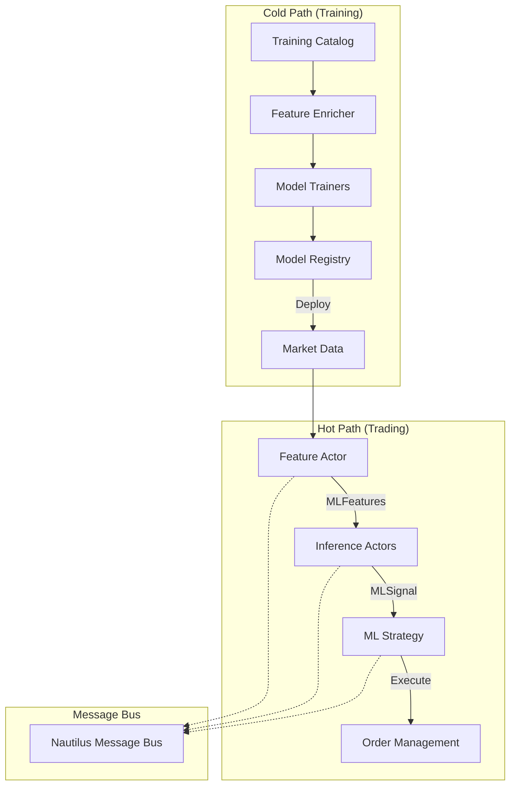

# ML Integration Architecture Plan

## Executive Summary

This document outlines the integration architecture for migrating the ML system from `OLD/trade/nautilus_ml` into the new `ml/` directory following Nautilus Trader patterns. The plan emphasizes:

- Strict hot/cold path separation
- Nautilus-native message passing and actor patterns
- Feature parity enforcement (< 1e-10 tolerance)
- msgspec for configuration
- ≥90% test coverage for ML modules

## Architecture Overview



## Key Architectural Changes from OLD

### 1. Configuration Migration (Pydantic → msgspec)

**OLD Pattern:**

```python
from pydantic import BaseModel
class MLActorConfig(BaseModel):
    model_name: str
    update_frequency: float = 60.0
```

**NEW Pattern:**

```python
from msgspec import Struct
class MLActorConfig(Struct, frozen=True):
    model_name: str
    update_frequency: float = 60.0
```

### 2. Data Types Migration

**OLD Custom Classes → Nautilus Data Types:**

```python
# OLD
class MLPrediction(Data):
    def __init__(self, ...):
        self.instrument_id = instrument_id
        # Custom initialization

# NEW
from nautilus_trader.core.data import Data
from nautilus_trader.model.data import DataType

class MLSignal(Data):
    """ML signal data following Nautilus patterns."""
    def __init__(self, instrument_id, prediction, confidence, ts_event, ts_init):
        self.instrument_id = instrument_id
        self.prediction = prediction
        self.confidence = confidence
        self._ts_event = ts_event
        self._ts_init = ts_init
```

### 3. Actor Communication Pattern

**OLD Direct Publishing:**

```python
self.publish_data(type(signal), signal)
```

**NEW Nautilus Pattern:**

```python
# Register data type
self.msgbus.register_type(DataType(MLSignal))

# Publish via message bus
self.msgbus.publish(
    topic=f"ml.signals.{instrument_id}",
    msg=signal
)
```

## Component Mapping

### From OLD to NEW Structure

| OLD Component | NEW Location | Changes Required |
|--------------|--------------|------------------|
| `training/base_trainer.py` | `ml/training/base.py` | Use msgspec config |
| `training/train_xgboost.py` | `ml/training/xgboost_trainer.py` | Remove MLflow dependencies from hot path |
| `actors/generic_inference_actor.py` | `ml/actors/inference_actor.py` | Use Nautilus message patterns |
| `strategies/ensemble_ml_strategy.py` | `ml/strategies/ensemble_strategy.py` | Replace custom messages with Nautilus types |
| `features/feature_engineering.py` | `ml/features/engineering.py` | Ensure exact parity |
| `registry/model_registry.py` | `ml/models/registry.py` | Keep MLflow for cold path only |

## Implementation Phases

### Phase 1: Core Infrastructure (Week 1)

1. **Create Base Classes**

   ```python
   # ml/actors/base.py
   from nautilus_trader.common.actor import Actor
   from nautilus_trader.config import ActorConfig

   class MLActorConfig(ActorConfig, frozen=True):
       """Base config for ML actors using msgspec."""
       model_name: str
       update_frequency: float = 60.0

   class BaseMLActor(Actor):
       """Base class for ML actors following Nautilus patterns."""
       def __init__(self, config: MLActorConfig):
           super().__init__(config)
   ```

2. **Define Data Types**

   ```python
   # ml/types.py
   from nautilus_trader.core.data import Data

   class MLFeatures(Data):
       """Features computed by feature actor."""
       pass

   class MLSignal(Data):
       """ML prediction signal."""
       pass

   class PortfolioTarget(Data):
       """Target position from ML strategy."""
       pass
   ```

### Phase 2: Feature Engineering Migration (Week 2)

1. **Feature Actor Implementation**

   ```python
   # ml/actors/feature_actor.py
   class FeatureActor(BaseMLActor):
       """Computes and broadcasts features."""

       def on_bar(self, bar: Bar):
           # Compute features using Nautilus indicators
           features = self._compute_features(bar)

           # Broadcast to all ML actors
           self.publish_data(
               DataType(MLFeatures),
               features
           )
   ```

2. **Feature Parity Enforcement**

   ```python
   # ml/tests/test_feature_parity.py
   def test_training_inference_parity():
       """CRITICAL: Ensure exact feature match."""
       train_features = compute_training_features(bars)
       inference_features = compute_inference_features(bars)

       np.testing.assert_allclose(
           train_features,
           inference_features,
           rtol=1e-10,
           err_msg="Feature parity violation!"
       )
   ```

### Phase 3: Actor Migration (Week 3)

1. **Inference Actor Pattern**

   ```python
   # ml/actors/inference_actor.py
   class MLInferenceActor(BaseMLActor):
       """Generic inference actor."""

       def on_start(self):
           # Load model at startup
           self.model = self._load_model()

           # Subscribe to features
           self.subscribe_data(
               data_type=DataType(MLFeatures)
           )

       def on_data(self, data: Data):
           if isinstance(data, MLFeatures):
               # Generate prediction
               signal = self._predict(data)

               # Publish signal
               self.publish_data(
                   DataType(MLSignal),
                   signal
               )
   ```

### Phase 4: Strategy Integration (Week 4)

1. **Ensemble Strategy**

   ```python
   # ml/strategies/ensemble_strategy.py
   class EnsembleMLStrategy(Strategy):
       """Aggregates ML signals and executes trades."""

       def on_start(self):
           # Subscribe to ML signals
           self.subscribe_data(
               data_type=DataType(MLSignal)
           )

       def on_data(self, data: Data):
           if isinstance(data, MLSignal):
               # Aggregate signals
               self._process_signal(data)

               # Generate orders if threshold met
               if self._should_trade():
                   self._execute_trade()
   ```

## Message Flow Architecture

### 1. Feature Broadcasting Pattern

```
Market Data → Feature Actor → MLFeatures → [All ML Actors]
```

### 2. Signal Aggregation Pattern

```
ML Actor 1 → MLSignal → Ensemble Strategy
ML Actor 2 → MLSignal → Ensemble Strategy
ML Actor 3 → MLSignal → Ensemble Strategy
```

### 3. Execution Pattern

```
Ensemble Strategy → Orders → Risk Engine → Exchange
```

## Hot/Cold Path Separation

### Cold Path (Training)

- Uses Polars/Pandas for data processing
- MLflow for experiment tracking
- Can use blocking I/O
- No real-time constraints

### Hot Path (Trading)

- NumPy arrays only
- Pre-allocated memory
- No blocking operations
- < 5ms latency requirement

## Configuration Examples

### Actor Configuration

```python
# ml/config/actors.py
from msgspec import Struct

class XGBoostActorConfig(MLActorConfig, frozen=True):
    """XGBoost inference actor config."""
    model_path: str
    feature_config: dict
    min_confidence: float = 0.6
```

### Strategy Configuration

```python
# ml/config/strategies.py
class EnsembleStrategyConfig(StrategyConfig, frozen=True):
    """Ensemble strategy config."""
    instrument_ids: list[InstrumentId]
    model_weights: dict[str, float]
    risk_per_trade: float = 0.02
    min_ensemble_confidence: float = 0.7
```

## Testing Strategy

### 1. Unit Tests (Per Component)

```python
# ml/tests/unit/test_inference_actor.py
def test_inference_actor_prediction():
    """Test prediction generation."""
    actor = MLInferenceActor(config)
    features = create_test_features()

    signal = actor._predict(features)

    assert isinstance(signal, MLSignal)
    assert 0 <= signal.confidence <= 1
```

### 2. Integration Tests (Message Flow)

```python
# ml/tests/integration/test_ml_pipeline.py
def test_end_to_end_ml_flow():
    """Test complete ML pipeline."""
    engine = BacktestEngine()

    # Add actors and strategy
    engine.add_actor(FeatureActor(config))
    engine.add_actor(MLInferenceActor(config))
    engine.add_strategy(EnsembleMLStrategy(config))

    # Run and verify signals generated
    engine.run()

    assert engine.message_bus.has_messages("ml.signals.*")
```

### 3. Performance Tests

```python
# ml/tests/performance/test_latency.py
def test_inference_latency():
    """Ensure < 5ms inference."""
    actor = MLInferenceActor(config)
    features = create_test_features()

    start = time.perf_counter()
    actor._predict(features)
    latency = (time.perf_counter() - start) * 1000

    assert latency < 5.0  # ms
```

## Pre-commit Hooks

### ML-Specific Hooks

```yaml
# .pre-commit-config.yaml
- repo: local
  hooks:
    - id: ml-test-coverage
      name: ML Test Coverage Check
      entry: python scripts/check_ml_coverage.py
      language: python
      files: ^ml/.*\.py$
      pass_filenames: false

    - id: feature-parity
      name: Feature Parity Check
      entry: python ml/tests/test_feature_parity.py
      language: python
      files: ^ml/features/.*\.py$
```

## Migration Checklist

### Week 1

- [ ] Create ml/ directory structure
- [ ] Implement base classes with msgspec
- [ ] Define Nautilus-compatible data types
- [ ] Set up pre-commit hooks

### Week 2

- [ ] Migrate feature engineering
- [ ] Implement feature parity tests
- [ ] Create feature actor

### Week 3

- [ ] Migrate XGBoost trainer
- [ ] Implement inference actors
- [ ] Test message flow

### Week 4

- [ ] Migrate ensemble strategy
- [ ] Full integration testing
- [ ] Performance validation

### Week 5

- [ ] Documentation
- [ ] Example notebooks
- [ ] Production deployment guide

## Success Criteria

1. **All tests pass with ≥90% coverage**
2. **Feature parity < 1e-10 tolerance**
3. **Inference latency < 5ms P99**
4. **Zero mypy errors**
5. **Successful backtest with ML strategy**
6. **All pre-commit hooks pass**

## Risk Mitigation

### Technical Risks

1. **Feature Drift**: Continuous parity testing
2. **Message Bus Overload**: Rate limiting and batching
3. **Model Loading Time**: Lazy loading with caching

### Process Risks

1. **Scope Creep**: Strict phase boundaries
2. **Breaking Changes**: Comprehensive test suite
3. **Performance Regression**: Automated benchmarks

## Next Steps

1. Review and approve this architecture
2. Create ml/ directory structure
3. Begin Phase 1 implementation
4. Set up CI/CD for ML modules
