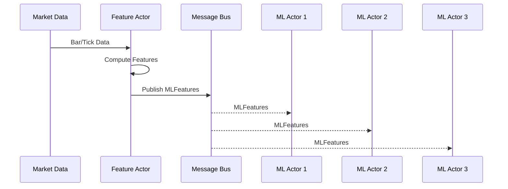
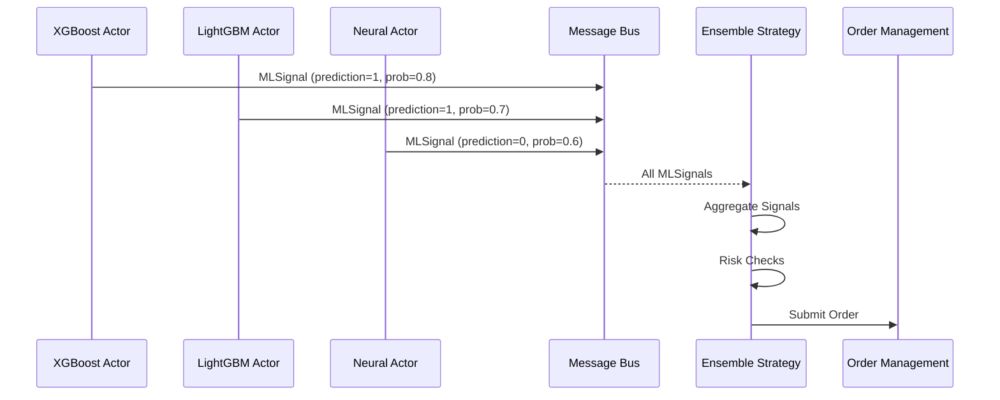
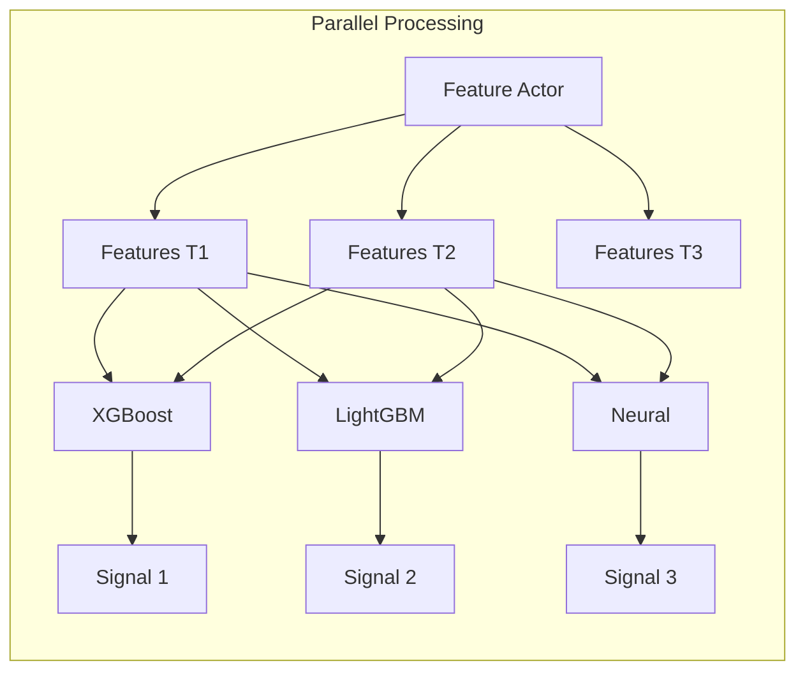
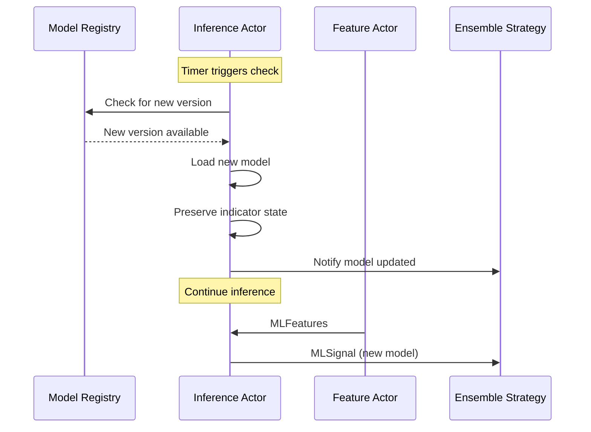

# ML System Message Flow Architecture

## Overview

This document details the message flow between ML components in the new Nautilus-integrated architecture, showing how data moves from market feeds through ML inference to trade execution.

## Message Types

### Core ML Data Types

```python
# ml/types.py
from nautilus_trader.core.data import Data
from nautilus_trader.model.identifiers import InstrumentId

class MLFeatures(Data):
    """Computed features for ML models."""
    def __init__(
        self,
        instrument_id: InstrumentId,
        features: dict[str, float],
        timestamp_ns: int,
        ts_event: int,
        ts_init: int,
    ):
        self.instrument_id = instrument_id
        self.features = features
        self.timestamp_ns = timestamp_ns
        self._ts_event = ts_event
        self._ts_init = ts_init

class MLSignal(Data):
    """ML model prediction signal."""
    def __init__(
        self,
        instrument_id: InstrumentId,
        model_name: str,
        prediction: int,  # -1, 0, 1
        probability: float,
        confidence: float,
        ts_event: int,
        ts_init: int,
    ):
        self.instrument_id = instrument_id
        self.model_name = model_name
        self.prediction = prediction
        self.probability = probability
        self.confidence = confidence
        self._ts_event = ts_event
        self._ts_init = ts_init

class EnsembleSignal(Data):
    """Aggregated signal from multiple models."""
    def __init__(
        self,
        instrument_id: InstrumentId,
        direction: int,  # -1, 0, 1
        strength: float,  # 0.0 to 1.0
        confidence: float,
        model_scores: dict[str, float],
        ts_event: int,
        ts_init: int,
    ):
        self.instrument_id = instrument_id
        self.direction = direction
        self.strength = strength
        self.confidence = confidence
        self.model_scores = model_scores
        self._ts_event = ts_event
        self._ts_init = ts_init
```

## Message Flow Patterns

### 1. Feature Broadcasting Pattern



**Implementation:**

```python
# ml/actors/feature_actor.py
class FeatureActor(Actor):
    def on_bar(self, bar: Bar) -> None:
        # Compute features
        features = self._compute_features(bar)

        # Create MLFeatures message
        ml_features = MLFeatures(
            instrument_id=bar.instrument_id,
            features=features,
            timestamp_ns=self.clock.timestamp_ns(),
            ts_event=bar.ts_event,
            ts_init=self.clock.timestamp_ns(),
        )

        # Broadcast to all ML actors
        self.publish_data(
            DataType(MLFeatures, metadata={"instrument_id": str(bar.instrument_id)}),
            ml_features,
        )
```

### 2. ML Signal Aggregation Pattern



**Implementation:**

```python
# ml/strategies/ensemble_strategy.py
class EnsembleMLStrategy(Strategy):
    def __init__(self, config: EnsembleStrategyConfig):
        super().__init__(config)
        self.signal_buffer: dict[str, deque] = defaultdict(
            lambda: deque(maxlen=10)
        )

    def on_start(self) -> None:
        # Subscribe to ML signals
        self.subscribe_data(DataType(MLSignal))

    def on_data(self, data: Data) -> None:
        if isinstance(data, MLSignal):
            # Buffer signals by model
            self.signal_buffer[data.model_name].append(data)

            # Check if we have enough signals
            if self._should_evaluate():
                self._evaluate_and_trade()

    def _evaluate_and_trade(self) -> None:
        # Aggregate signals
        ensemble = self._aggregate_signals()

        if ensemble.confidence > self.config.min_confidence:
            # Create and submit order
            order = self._create_order(ensemble)
            self.submit_order(order)
```

### 3. Parallel Inference Pattern



### 4. Hot-Reload Pattern



## Topic Naming Convention

### Feature Topics

```
features.{instrument_id}              # Features for specific instrument
features.all                          # Broadcast features
```

### Signal Topics

```
ml.signals.{model_name}.{instrument_id}    # Model-specific signals
ml.signals.all                             # All signals
ml.signals.ensemble.{instrument_id}        # Ensemble signals
```

### Control Topics

```
ml.control.reload                     # Trigger model reload
ml.control.shutdown                   # Graceful shutdown
ml.control.health                     # Health check request
```

## Message Bus Configuration

```python
# ml/config/message_bus.py
from nautilus_trader.msgbus.bus import MessageBus

def configure_ml_message_bus(msgbus: MessageBus) -> None:
    """Configure message bus for ML system."""

    # Register ML data types
    msgbus.register_type(DataType(MLFeatures))
    msgbus.register_type(DataType(MLSignal))
    msgbus.register_type(DataType(EnsembleSignal))

    # Set up routing
    msgbus.subscribe(
        topic="features.*",
        handler=lambda msg: None,  # Actors will subscribe
    )

    msgbus.subscribe(
        topic="ml.signals.*",
        handler=lambda msg: None,  # Strategy will subscribe
    )
```

## Error Handling and Recovery

### Failed Inference Handling

```python
class MLInferenceActor(Actor):
    def on_data(self, data: Data) -> None:
        if isinstance(data, MLFeatures):
            try:
                signal = self._generate_prediction(data)
                self.publish_data(DataType(MLSignal), signal)
            except Exception as e:
                self.log.error(f"Inference failed: {e}")
                # Publish error signal
                error_signal = MLSignal(
                    instrument_id=data.instrument_id,
                    model_name=self.config.model_name,
                    prediction=0,  # Neutral
                    probability=0.5,
                    confidence=0.0,  # No confidence
                    ts_event=data._ts_event,
                    ts_init=self.clock.timestamp_ns(),
                )
                self.publish_data(DataType(MLSignal), error_signal)
```

### Message Queue Overflow Protection

```python
class EnsembleMLStrategy(Strategy):
    def __init__(self, config):
        super().__init__(config)
        self.max_queue_size = 1000
        self.signal_queue = deque(maxlen=self.max_queue_size)

    def on_data(self, data: Data) -> None:
        if len(self.signal_queue) >= self.max_queue_size:
            self.log.warning("Signal queue full, dropping oldest")
        self.signal_queue.append(data)
```

## Performance Considerations

### 1. Message Batching

```python
class FeatureActor(Actor):
    def __init__(self, config):
        super().__init__(config)
        self.feature_batch = []
        self.batch_size = 10

    def on_bar(self, bar: Bar) -> None:
        features = self._compute_features(bar)
        self.feature_batch.append(features)

        if len(self.feature_batch) >= self.batch_size:
            # Publish batch
            self._publish_batch()
            self.feature_batch.clear()
```

### 2. Topic Filtering

```python
class MLInferenceActor(Actor):
    def on_start(self) -> None:
        # Subscribe only to relevant instruments
        for instrument_id in self.config.instrument_ids:
            self.subscribe_data(
                DataType(MLFeatures),
                topic=f"features.{instrument_id}",
            )
```

### 3. Message Priority

```python
# High priority for execution signals
self.publish_data(
    DataType(EnsembleSignal),
    signal,
    priority=MessagePriority.HIGH,
)

# Normal priority for features
self.publish_data(
    DataType(MLFeatures),
    features,
    priority=MessagePriority.NORMAL,
)
```

## Monitoring and Debugging

### Message Flow Metrics

```python
class MLMetricsActor(Actor):
    """Monitors ML message flow."""

    def on_start(self) -> None:
        # Subscribe to all ML messages
        self.subscribe_data(DataType(MLFeatures), topic="features.*")
        self.subscribe_data(DataType(MLSignal), topic="ml.signals.*")

        # Track metrics
        self.message_counts = defaultdict(int)
        self.message_latencies = defaultdict(list)

    def on_data(self, data: Data) -> None:
        # Track message
        msg_type = type(data).__name__
        self.message_counts[msg_type] += 1

        # Calculate latency
        latency = self.clock.timestamp_ns() - data._ts_init
        self.message_latencies[msg_type].append(latency)

        # Log if latency exceeds threshold
        if latency > 5_000_000:  # 5ms
            self.log.warning(f"High latency for {msg_type}: {latency/1e6:.2f}ms")
```

### Debug Message Tracing

```python
# Enable debug mode for specific instruments
if self.config.debug_mode:
    self.log.debug(
        f"MLSignal: {data.model_name} -> {data.prediction} "
        f"(prob={data.probability:.3f}, conf={data.confidence:.3f})"
    )
```

## Integration Example

```python
# ml/examples/integrated_system.py
def create_ml_system(engine: TradingEngine) -> None:
    """Create integrated ML trading system."""

    # Create feature actor
    feature_actor = FeatureActor(
        config=FeatureActorConfig(
            actor_id="FEATURE-001",
            instrument_ids=["AAPL.NASDAQ", "MSFT.NASDAQ"],
        )
    )

    # Create ML inference actors
    xgboost_actor = MLInferenceActor(
        config=MLActorConfig(
            actor_id="ML-XGBOOST-001",
            model_name="xgboost_momentum",
            model_path="models/xgboost_latest.pkl",
        )
    )

    lightgbm_actor = MLInferenceActor(
        config=MLActorConfig(
            actor_id="ML-LIGHTGBM-001",
            model_name="lightgbm_meanrev",
            model_path="models/lightgbm_latest.pkl",
        )
    )

    # Create ensemble strategy
    ensemble_strategy = EnsembleMLStrategy(
        config=EnsembleStrategyConfig(
            strategy_id="ML-ENSEMBLE-001",
            instrument_ids=["AAPL.NASDAQ", "MSFT.NASDAQ"],
            model_weights={
                "xgboost_momentum": 0.6,
                "lightgbm_meanrev": 0.4,
            },
            min_confidence=0.7,
        )
    )

    # Add to engine
    engine.add_actor(feature_actor)
    engine.add_actor(xgboost_actor)
    engine.add_actor(lightgbm_actor)
    engine.add_strategy(ensemble_strategy)

    # Configure message bus
    configure_ml_message_bus(engine.msgbus)
```

## Summary

This message flow architecture provides:

1. **Clear separation of concerns** - Each component has a specific role
2. **Scalable design** - Easy to add more models or instruments
3. **Fault tolerance** - Graceful handling of failures
4. **Performance optimization** - Batching and filtering capabilities
5. **Observable system** - Built-in monitoring and debugging

The architecture follows Nautilus Trader patterns while maintaining the sophisticated ML capabilities from the original system.
