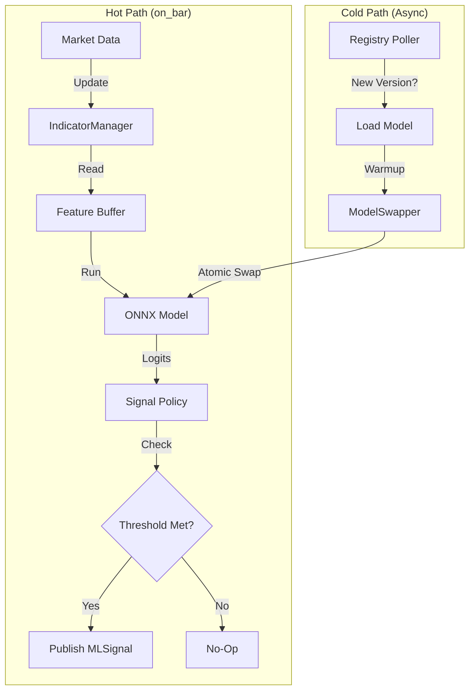

# ML Signal Actor

**Status:** Living Document
**Root:** `ml/actors/signal.py`
**Key Class:** `MLSignalActor`

## 1. System Overview

The `MLSignalActor` is the primary production class for running ML models in the hot path. It inherits from `BaseMLInferenceActor` but adds the concrete logic for **Signal Policy**, **Hot Swapping**, and **Metrics**.

**Key Responsibility:** Convert raw model outputs (logits/probabilities) into actionable trading signals (`MLSignal`) while respecting latency budgets and circuit breakers.

## 2. Key Capabilities

### A. Signal Policy (`SignalGenerationStrategy`)
The actor decouples "Prediction" from "Decision".

-   **Threshold:** `confidence >= threshold`.
-   **Adaptive:** `confidence >= threshold * volatility_factor`.
-   **Momentum:** Prediction must agree with recent trend.
-   **Ensemble:** Weighted vote of multiple sub-strategies.

### B. Atomic Hot-Swap
The actor supports **Zero-Downtime Updates**.

-   **Model Swap:** `ModelSwapper` loads the new ONNX file in the background. On the next `on_bar` tick, it atomically flips the `self._model` pointer.
-   **Policy Swap:** `SignalPolicySwapper` allows changing the logic (e.g., switching from "Static" to "Adaptive" thresholds) at runtime without restarting.

### C. Zero-Allocation Hot Path

-   **Feature Buffer:** `self._feature_buffer` is pre-allocated (float32).
-   **Input Buffer:** `self._predict_input_buf` (1xN) avoids reshaping overhead during inference.
-   **Metrics:** `PerformanceMonitor` uses ring buffers for latency tracking, avoiding `list.append` in the hot loop.

## 3. Configuration (`MLSignalActorConfig`)

-   `prediction_threshold`: Base confidence required.
-   `signal_strategy`: The default policy (`threshold`, `adaptive`, etc.).
-   `optimization_config`: Controls buffer pre-allocation and warm-up iterations.

## 4. Data Flow

