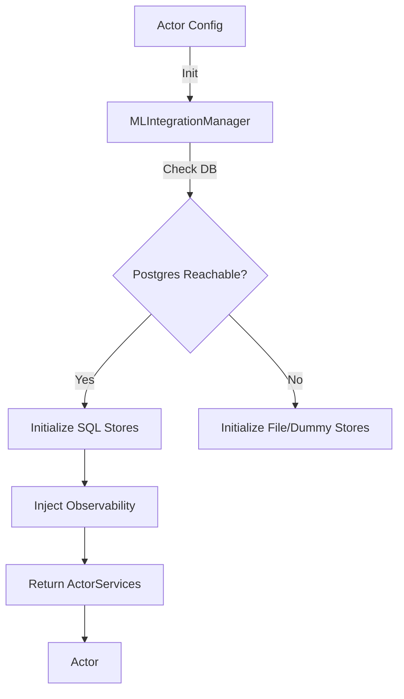

# Core Integration Architecture

**Status:** Living Document
**Root:** `ml/core/`
**Key Classes:** `MLIntegrationManager`, `EngineManager`

## 1. System Overview

The `ml/core` module is the structural backbone of the ML system. It is responsible for:

1.  **Wiring:** Connecting components (Stores, Registries) without hard-coded dependencies (`integration.py`).
2.  **Lifecycle:** Managing the startup/shutdown of database connections and persistence threads.
3.  **Performance Primitives:** Providing the optimized data structures used by the Hot Path (`cache.py`).

## 2. Integration Manager (`integration.py`)

The `MLIntegrationManager` implements the **Universal Pattern 1 (4-Store + 4-Registry)**.

### A. Progressive Fallback
It initializes stores in a priority order:

1.  **Postgres (Primary):** Used if `NAUTILUS_DB` is reachable.
2.  **File-Backed:** Used if Postgres is down but local disk is writable.
3.  **Dummy:** In-memory fallback for unit tests.

### B. Registry Wiring
It automatically connects the `DataStore` to the `DataRegistry`, ensuring that every `write()` operation is validated against a registered schema.

### C. Observability Injection
It injects the `ObservabilityService` into all stores, enabling transparent metrics collection for every database operation without cluttering the store logic.

## 3. High-Performance Cache (`cache.py`)

This module provides the **Zero-Allocation** primitives required by `ml/actors`.

### A. `LockFreeRingBuffer`

-   **Purpose:** Storing price history (OHLCV) for windowed feature computation.
-   **Optimization:** Uses a pre-allocated `numpy` array and a moving index. `append(x)` is O(1) and never triggers GC.

### B. `PreAllocatedFeatureCache`

-   **Purpose:** Maintaining the feature vector $X_t$.
-   **Optimization:** Exposes `memoryview` interfaces (`get_current_view()`) so that `calculate_features_online` writes directly into the buffer, avoiding `malloc`.

### C. `ReservoirSampler`

-   **Purpose:** Estimating percentiles (e.g., for `AdaptiveStrategy`) over an infinite stream without unbounded memory.

## 4. Database Engine (`db_engine.py`)

-   **Singleton Pattern:** Ensures only one `Engine` exists per process.
-   **Connection Pooling:** Manages SQLAlchemy pool settings (size, overflow) to prevent connection leaks under load.

## 5. Data Flow

## 6. Code Audit Findings (2025-11-19)

### A. Migration Blocking (`integration.py`)

-   **Severity:** **MODERATE**
-   **Location:** `_run_migrations` (Line ~780)
-   **Issue:** Synchronous execution of DB migrations on process startup.
-   **Impact:** Can cause deployment timeouts (Kubernetes Liveness Probes) if migration takes >30s.

### B. Singleton State (`integration.py`)

-   **Severity:** **MINOR**
-   **Location:** `_integration_manager` (Global Variable)
-   **Issue:** Relies on global module-level state.
-   **Impact:** Makes unit testing difficult; tests must manually call `reset_integration_manager()` to avoid side effects.
