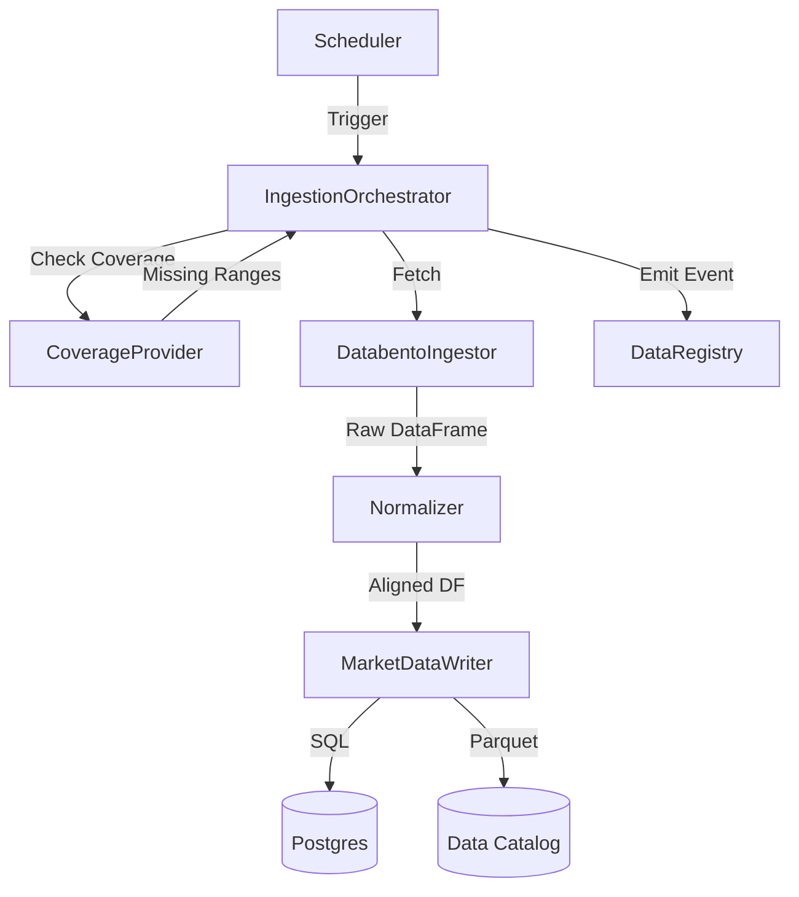

# ML Data Ingestion

**Status:** Living Document
**Root:** `ml/data/ingest/`
**Key Class:** `IngestionOrchestrator`

## 1. System Overview

The ingestion subsystem is responsible for reliably fetching, normalizing, and storing market data from external providers (primarily Databento) into the system's Data Store (Postgres) and Data Catalog (Parquet).

**Core Responsibilities:**

-   **Gap Detection:** Identifying missing data ranges in the local store (`coverage`).
-   **Backfilling:** Fetching historical data to fill gaps.
-   **Normalization:** converting raw API responses into `ts_event` (nanosecond int64) aligned DataFrames.
-   **Persistence:** Writing to both SQL (for metadata/queries) and Parquet (for bulk training).

## 2. Key Components

### A. Orchestrator (`orchestrator.py`)

-   **`IngestionOrchestrator`**: The brain. It coordinates the `CoverageProvider`, `DatabentoIngestor`, and `MarketDataWriter`.
-   **Workflow:**
    1.  `resolve_market_bindings`: Maps symbols to datasets.
    2.  `backfill_gaps`: Calculates missing day-buckets.
    3.  `_clamp_window_to_available_range`: Ensures we don't ask for future data.
    4.  `writer.write`: Persists the data.
    5.  `registry.emit_event`: Signals that data is ready (`DATA_INGESTED`).

### B. Service (`service.py`)

-   **`DatabentoIngestionService`**: The concrete implementation for Databento.
-   Handles API limits and costs.
-   Chunks large requests.

### C. Vintage (`ml/data/vintage.py`)

-   **Point-in-Time Logic:** Essential for Macro data. Ensures that at training time $t$, we only see data *published* before $t$, not revised values released later.
-   **`VintagePolicy`**: `REAL_TIME` (use original values) vs `FINAL` (use latest revision).

## 3. Data Flow

## 4. Key Invariants

1.  **Nanosecond Precision:** All timestamps (`ts_event`) must be `int64` nanoseconds (UNIX epoch).
2.  **Gap-Free:** The orchestrator actively seeks to fill contiguous gaps.
3.  **Dual-Write:** Data is often written to both SQL (metadata/small) and Parquet (bulk).
