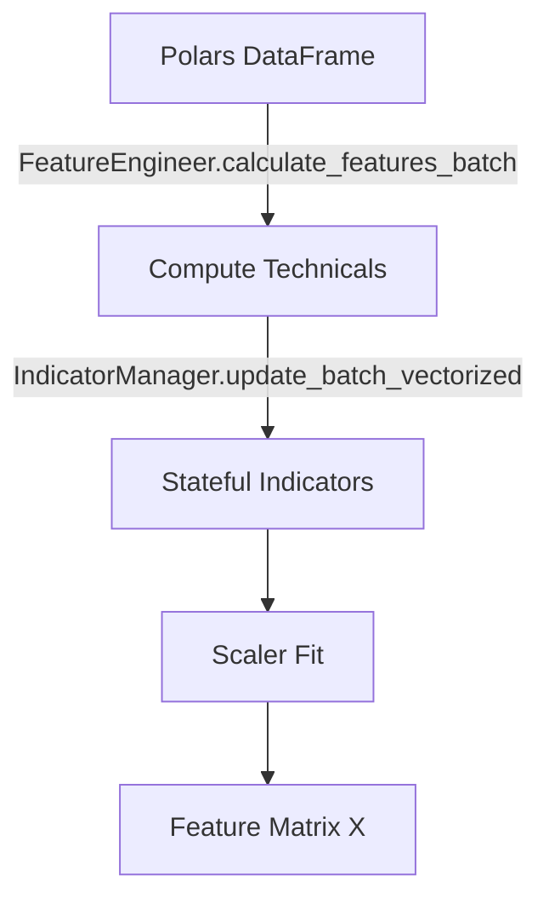
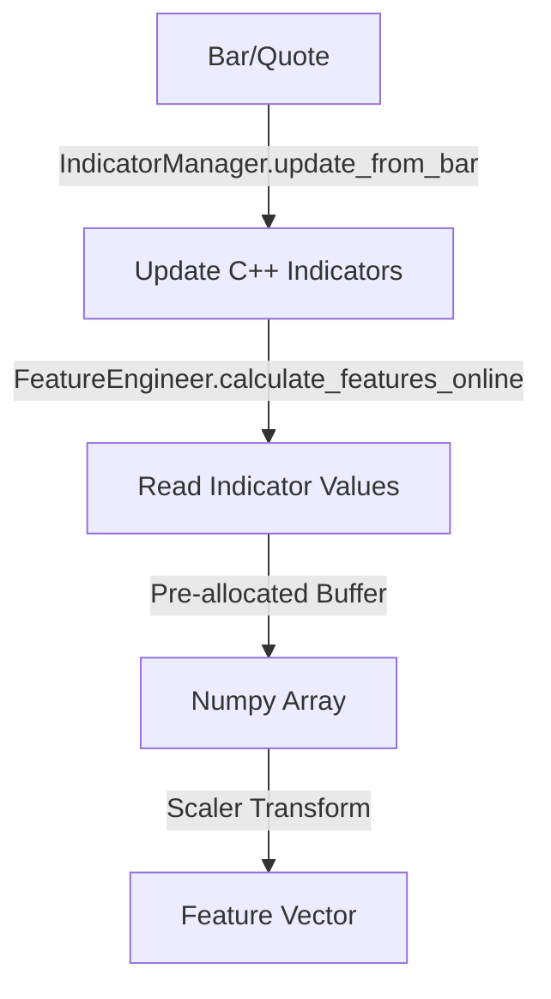

# ML Features Architecture

**Status:** Living Document
**Root:** `ml/features/`
**Primary Dependency:** `nautilus_trader` (Indicators), `polars`

## 1. System Overview

The `ml/features` module implements the **Universal ML Architecture Pattern 3** (Hot/Cold Path Separation). It guarantees that feature calculations are identical whether running in a batch training pipeline (Cold Path) or inside a live trading actor (Hot Path).

**Key Design Goal:** `Parity`

-   **Batch:** Uses Polars/Vectorization for throughput.
-   **Online:** Uses stateful `IndicatorManager` and zero-allocation numpy buffers for latency.
-   **Validation:** `FeatureParityValidator` mathematically proves that `Batch(Data) == Online(Data)`.

## 2. Core Components

### A. Engineering Engine (`engineering.py`)

-   **`FeatureConfig`**: The single source of truth for feature parameters (e.g., `rsi_period=14`).
-   **`FeatureEngineer`**: The main facade.
-   `calculate_features_batch(df)`: Cold path entry point.
-   `calculate_features_online(bar)`: Hot path entry point.
-   **Dependency Injection:** Can receive a `feature_store` or full `stores` container.
-   **`IndicatorManager`**: Wraps Nautilus C++ indicators (`AverageTrueRange`, `MACD`, etc.) to maintain state.
-   *Critical:* It manually manages history buffers (`price_history`) to feed indicators that need windowed data.

### B. Pipelines (`pipeline.py`)

-   **`PipelineSpec`**: A declarative list of transformations.
-   **`PipelineRunner`**: Executes the pipeline. It determines the final list of feature names and their order.
-   **`FeatureTransform`**: Protocol for adding new feature logic.

### C. Advanced Features

-   **`microstructure.py`**: L2 Book features (Imbalance, Order Flow). *Note: Currently batch-only pending Actor support.*
-   **`cross_asset/`**: Correlations and Betas between instruments.
-   **`earnings/`**: Features derived from earnings calendar data (Post-Earnings Announcement Drift).
-   **`macro_*.py`**: Logic for handling Macroeconomic data (FRED/ALFRED).

## 3. Validation Strategy
The module includes `FeatureParityValidator` which runs a "Simulated Online" loop over historical data and compares the result against the Batch implementation.

-   **Tolerance:** Strict `1e-10` by default.

## 4. Data Flow

### Cold Path (Training)

### Hot Path (Inference)

## 5. Important Files

-   `ml/features/engineering.py`: **[CRITICAL]** The brain of the system. Contains the dual-path logic.
-   `ml/features/__init__.py`: Exposes the public API and handles lazy loading to prevent circular imports.
-   `ml/features/validation.py`: The parity checking logic.

## 6. Constraints & Invariants

1.  **Zero Allocation (Hot Path):** `calculate_features_online` must not allocate new arrays. It writes into `self.feature_buffer`.
2.  **Determinism:** Both paths *must* yield identical floats.
3.  **Scaler Parity:** The `StandardScaler` fitted in batch mode must be exactly reusable in online mode.

## 7. Code Audit Findings (2025-11-19)

### A. Fake Vectorization (`engineering.py`)

-   **Severity:** **CRITICAL**
-   **Location:** `IndicatorManager.update_batch_vectorized` (Line ~578)
-   **Issue:** The method claims to be vectorized but iterates row-by-row using a Python loop (`for idx in range(n_bars)`).
-   **Impact:** Disables Polars optimization; effectively runs Python speed on batch data.

### B. Hidden Allocations (`engineering.py`)

-   **Severity:** **CRITICAL**
-   **Location:** `IndicatorManager.update_from_bar` (Line ~515)
-   **Issue:** `self.price_history[key] = self.price_history[key][-max_history:]` creates a **new list copy** on every single bar update.
-   **Impact:** O(N) memory churn in the Hot Path. Violates "Zero Allocation" constraint.

### C. Batch Efficiency (`engineering.py`)

-   **Severity:** **MAJOR**
-   **Location:** `FeatureEngineer._calculate_features_batch_impl` (Line ~1368)
-   **Issue:** Iterates `for idx in range(len(close_prices))` to compute features sequentially.
-   **Impact:** Cold path is strictly sequential and Python-bound.
