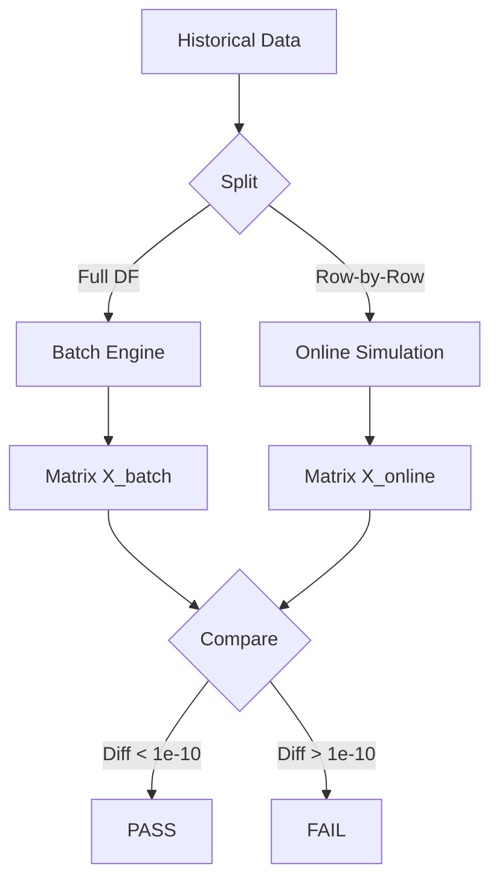

# Feature Parity Validation

**Status:** Living Document
**Root:** `ml/features/validation.py`
**Key Class:** `FeatureParityValidator`

## 1. System Overview

The **Parity Validator** is the "Unit Test for Mathematics" in the ML system. It ensures that the **Vectorized Batch implementation** (used for training) yields bit-identical results to the **Iterative Online implementation** (used for trading).

**The Problem:**

-   Batch uses `polars` / `pandas` (entire column at once).
-   Online uses `numpy` state buffers (one value at a time).
-   Small implementation differences (e.g., `mean` vs `rolling_mean`, float precision) can lead to "Training-Serving Skew," where a model works in backtest but fails in production.

## 2. The Validation Algorithm

1.  **Prepare Data:** Take a slice of historical data (e.g., 1000 bars).
2.  **Run Batch:** Compute features using `FeatureEngineer.calculate_features_batch(df)`.
3.  **Run Online Simulation:**
    -   Instantiate a fresh `IndicatorManager`.
    -   Loop through the data row-by-row.
    -   Call `indicator_mgr.update_from_bar(row)`.
    -   Call `feature_engineer.calculate_features_online(row)`.
    -   Collect result vectors.
4.  **Compare:** Calculate `max(abs(Batch - Online))`.
5.  **Assert:** Fail if difference > `tolerance` (default `1e-10`).

## 3. Critical Details

### Warm-up
The validator handles **Warm-up** carefully.

-   Batch calculation has access to the full history immediately.
-   Online calculation starts empty.
-   **Solution:** The validator "pre-warms" the Online `IndicatorManager` with `start_idx` bars before beginning the comparison.

### Tolerances

-   **Default:** `1e-10` (Strict float64 equality).
-   **Relaxed:** Some complex indicators (like recursive EMAs) may drift slightly due to floating-point accumulation order.

## 4. Data Flow

