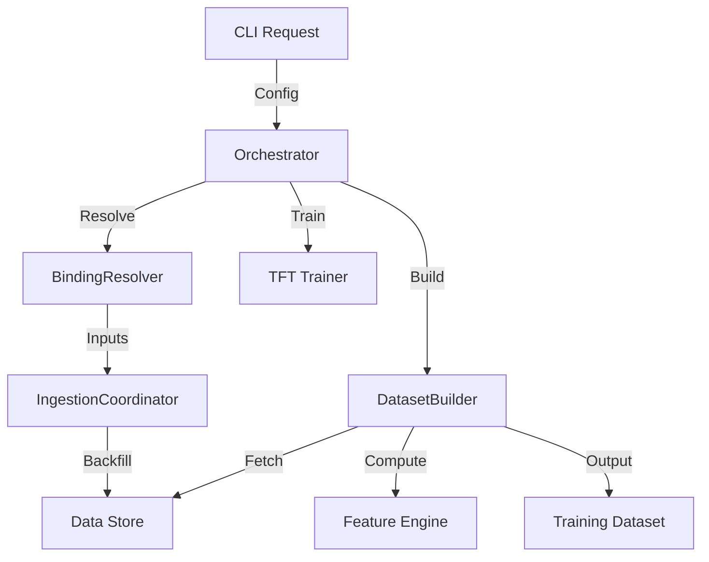

# Pipeline Orchestrator Architecture

**Status:** Living Document
**Root:** `ml/orchestration/`
**Key Class:** `MLPipelineOrchestrator`

## 1. System Overview

The `MLPipelineOrchestrator` is the high-level coordinator for the "Teacher" (Cold Path) workflow. It strings together ingestion, dataset building, and training into a coherent pipeline.

**Migration Status:**
It uses a **Strangler Fig** pattern (`_use_component_impl()`) to switch between:

-   **Legacy:** `pipeline_orchestrator_legacy.py` (Monolithic God Class).
-   **Component:** `pipeline_orchestrator_component.py` (Decomposed into `BindingResolver`, `ConfigResolver`, `IngestionCoordinator`, `DatasetBuilder`).

## 2. Component Architecture (New Path)

When `ML_USE_COMPONENT_PIPELINE_ORCHESTRATOR=1`:

### A. Discovery & Binding

-   **`DiscoveryClient`**: Queries the DataRegistry or external APIs to find available data.
-   **`BindingResolver`**: Matches requested inputs (e.g., "EURUSD") to concrete Datasets (e.g., "GLBX.MDP3.EURUSD").

### B. Ingestion Coordination

-   **`IngestionCoordinator`**: Wraps the `ml/data/ingest/` subsystem. It calls `IngestionOrchestrator.backfill_gaps` to ensure data exists locally before training starts.

### C. Dataset Construction

-   **`DatasetBuilder`**: Wraps `TFTDatasetBuilder`. It manages the `DataStore` vs `FeatureStore` selection logic.

## 3. Execution Flow

## 4. Key Invariants

1.  **Gap-Free Input:** The orchestrator *must* ensure data continuity before building a dataset.
2.  **Configuration driven:** All steps are defined by a `PipelineConfig` object.

## 5. Code Audit Findings (2025-11-19)

### A. Silent Null Writers (`pipeline_orchestrator.py`)

-   **Severity:** **MAJOR**
-   **Location:** `class _NullMarketDataWriter` (Line ~60)
-   **Issue:** If a writer isn't injected, the system defaults to a "Null Object" that silently discards data (`return 0`).
-   **Impact:** Users may run a pipeline believing data is saved, with no error raised.

### B. God Class Wrapper (`pipeline_orchestrator.py`)

-   **Severity:** **MODERATE**
-   **Location:** `class _CompatibleLegacyOrchestrator` (Line ~75)
-   **Issue:** Inherits from the massive Legacy implementation while mixing in new components.
-   **Impact:** Makes it extremely difficult to trace which logic (Legacy vs Component) is actually executing at runtime.
