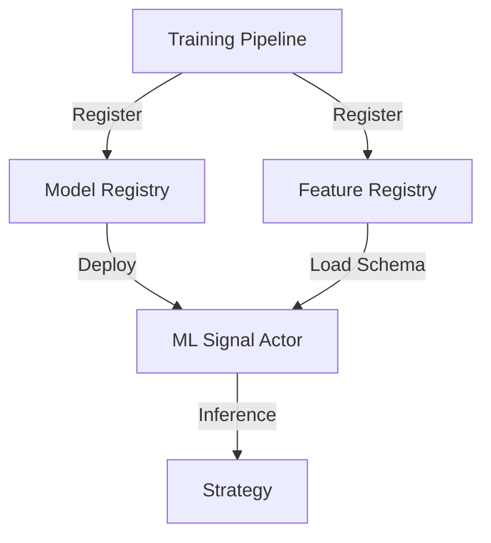

# ML Registry Architecture

**Status:** Living Document
**Root:** `ml/registry/`
**Context:** The central management layer for ML artifacts, metadata, and lifecycle.

## 1. System Overview

The `ml/registry` module implements **Pattern 1** of the Universal ML Architecture. It provides a set of mandatory registries that all Actors and Pipelines must use. It replaces ad-hoc file storage with a structured, persistent, and thread-safe system.

**The 4 Pillars:**

1.  **Model Registry:** Tracks trained models (`.onnx`), their lineage, and deployment status.
2.  **Feature Registry:** Tracks feature definitions, schemas, and parity digests.
3.  **Strategy Registry:** Tracks strategy configurations and their compatibility with models.
4.  **Data Registry:** Tracks dataset lineage and manifests.

## 2. Core Components

### A. Protocols & Base

-   **`RegistryProtocol`**: The abstract interface all registries must implement.
-   **`AbstractRegistry`**: Common logic for thread-locking, persistence selection (JSON vs Postgres), and health checks.
-   **`DummyRegistry`**: A no-op implementation for fast unit testing without I/O.

### B. Model Registry (`model_registry.py`)

-   **`ModelManifest`**: The "Passport" of a model. Contains:
-   `model_id`, `version`, `role` (Teacher/Student).
-   `feature_schema_hash`: Links to the Feature Registry.
-   `artifact_sha256_digest`: Security checksum.
-   **Security:** Enforces that serveable models must be **ONNX** format to prevent pickle deserialization attacks.
-   **Lifecycle:** Supports `DeploymentStatus` (Inactive -> Testing -> Active -> Retired).

### C. Feature Registry (`feature_registry.py`)

-   **`FeatureManifest`**: Describes a feature set.
-   `pipeline_signature`: A hash of the transformation graph.
-   `parity_digest`: Proof that Batch and Online calculations match.
-   **Quality Gates:** Can block promotion if parity tolerance (`1e-10`) is violated.

### D. Persistence Layer

-   **`persistence.py`**: Handles the actual storage.
-   **JSON:** Default for local dev (human-readable).
-   **PostgreSQL:** Production backend (via SQLAlchemy).

## 3. Data Flow

## 4. Important Files

-   `ml/registry/__init__.py`: **[CRITICAL]** Facade that exposes the 4 registries.
-   `ml/registry/model_registry.py`: The logic for model versioning and security.
-   `ml/registry/dataclasses.py`: Shared types like `QualityGate` and `ValidationResult`.

## 5. Key Invariants

1.  **Schema Linkage:** A Model *must* reference a valid Feature Set via `feature_schema_hash`.
2.  **Immutable Artifacts:** Once registered, an artifact (ONNX file) should not change. The registry calculates SHA256 on entry.
3.  **Format Strictness:** Hot-path models must be ONNX.

## 6. Code Audit Findings (2025-11-19)

### A. Scalability Bottleneck (`model_registry.py`)

-   **Severity:** **MAJOR**
-   **Location:** `_load_registry` (Line ~160)
-   **Issue:** Loads **all** models into memory on initialization, regardless of backend (JSON or Postgres).
-   **Impact:** Registry startup time scales linearly with history. Will eventually OOM or timeout in production.

### B. Path Traversal Risk (`model_registry.py`)

-   **Severity:** **MINOR**
-   **Location:** `_validate_model_path` (Line ~1050)
-   **Issue:** Relies on string prefix matching (`startswith`) after `resolve()`.
-   **Impact:** Generally safe, but `resolve()` behavior can be subtle with symlinks. A chroot jail is preferred for high security.
