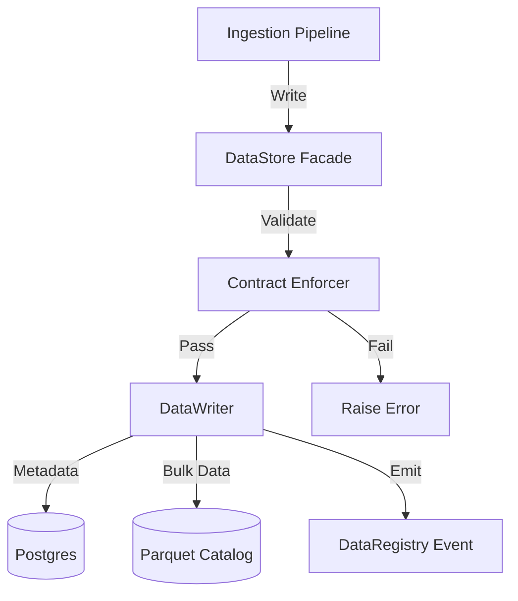

# ML Stores Architecture

**Status:** Living Document
**Root:** `ml/stores/`
**Key Classes:** `DataStore`, `FeatureStore`, `ModelStore`

## 1. System Overview

The `ml/stores` module implements the **4-Store Pattern**. It provides the persistence and retrieval logic for all ML artifacts.

**Key Invariant:**
Stores are **Facades**. They delegate to specialized sub-components (`Reader`, `Writer`, `Validator`, `Enforcer`) but present a unified, backward-compatible API to the rest of the system.

## 2. The Feature Store (`feature_store.py`)

The `FeatureStore` handles the lifecycle of feature vectors ($X_t$).

### A. Component Architecture
The `ComponentFeatureStore` facade delegates to:

1.  **`FeatureTableManager`**: Creates/Migrates SQL tables (`ml_feature_values`).
2.  **`FeatureVersioning`**: Hashes the `FeatureConfig` + `PipelineSpec` to generate a stable `feature_set_id`.
3.  **`FeaturePersistence`**: Writes features (Batch or Row).
4.  **`FeatureRetrieval`**: Reads features (Time-Travel queries).
5.  **`FeatureComputation`**: The "Engine Room" that calls `FeatureEngineer` (from `ml/features`) to backfill historical data.

### B. Feature Flagging
It uses a **Strangler Fig Pattern** via `_should_use_component_impl()`:

-   `ML_USE_LEGACY_FEATURE_STORE=1` -> Uses the old monolith class.
-   `ML_USE_COMPONENT_FEATURE_STORE=1` -> Uses the new decomposed classes.

## 3. The Data Store (`data_store.py`)

The `DataStore` manages raw market data (L1/L2, Earnings, Events).

### A. Hybrid Storage

-   **Postgres:** Stores metadata, earnings, signals, and small datasets.
-   **Parquet (via `RawIngestionWriterProtocol`):** Stores bulk market ticks (high-volume).

### B. Contract Enforcement (`contract_enforcer.py`)
Before writing, the `DataStore` checks the data against a `DataContract` loaded from the `DataRegistry`.

-   **Schema Validation:** Checks column names and types.
-   **Quality Gates:** Checks null rates and value ranges.

## 4. Data Flow (Write)

## 5. Key Invariants

1.  **Backward Compatibility:** Both `DataStore` and `FeatureStore` default to "Legacy Mode" unless explicitly opted-in via env vars (safeguarding production stability).
2.  **Shared Registry:** All stores inject the `DataRegistry` to emit lineage events (`DATA_INGESTED`, `FEATURE_COMPUTED`).
3.  **Zero-Downtime Migration:** The facades allow swapping implementations without changing call sites.

## 6. Code Audit Findings (2025-11-19)

### A. Synchronous I/O (`feature_persistence.py`)

-   **Severity:** **CRITICAL (if misused)**
-   **Location:** `_execute_write` (Line ~120)
-   **Issue:** Uses blocking SQLAlchemy calls.
-   **Impact:** If `MLSignalActor` falls back to this synchronous store (as seen in `actors/base.py`), it **will** violate the <5ms latency budget. This class MUST remain "Cold Path Only".

### B. Row-Level Overhead (`feature_persistence.py`)

-   **Severity:** **MODERATE**
-   **Location:** `_execute_write` (Line ~100)
-   **Issue:** Calls `sanitize_timestamp_ns` individually for every row, even in batch mode.
-   **Impact:** Unnecessary CPU overhead during bulk ingestion.
