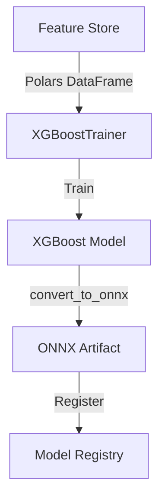
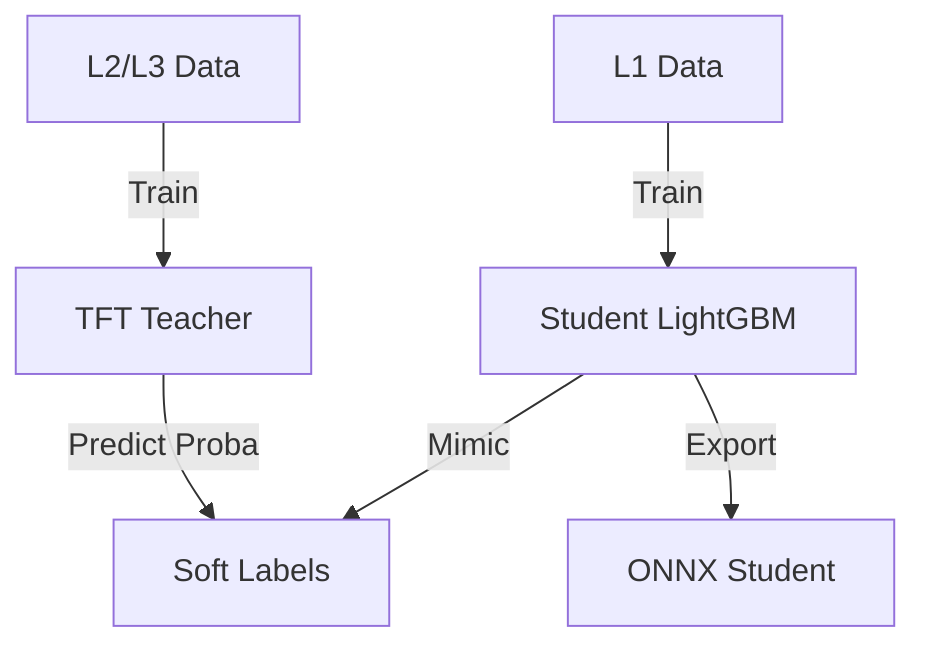

# ML Training Architecture

**Status:** Living Document
**Root:** `ml/training/`
**Architecture Pattern:** Cold Path

## 1. System Overview

The `ml/training` module implements **Pattern 3 (Cold Path Separation)**. It handles all model training, optimization, and export tasks.

**Critical Constraint:** Training code *never* runs in the hot path. It is resource-intensive (hours) and produces optimized artifacts (seconds) for the hot path.

## 2. Core Components

### A. Trainers (`ml/training/non_distilled/`)

-   **`XGBoostTrainer`**: Standard gradient boosting.
-   **`LightGBMTrainer`**: Faster boosting, supports categorical features.
-   **`TFTTeacher`**: Temporal Fusion Transformer for complex time-series patterns.

### B. Distillation Framework (`ml/training/distillation/`)

-   **Teacher-Student Pattern:**
-   **Teacher:** Heavy model (e.g., TFT) trained on rich data (L2/L3/Macro). Generates "Soft Labels".
-   **Student:** Lightweight model (e.g., LightGBM) trained to mimic the Teacher but using only L1 data (Prices/Vol).
-   **Benefit:** Allows deploying high-intelligence signals into low-latency environments (`ml_signal_actor`).

### C. Export & Production (`export.py`)

-   **`ModelExportMixin`**: Ensures every trainer can produce a standardized output.
-   **`convert_to_onnx`**: The primary export path.
-   **`save_model_with_metadata`**: Writes the `.onnx` file plus a `.meta.json` sidecar.

### D. Optimization (`optuna_optimizer.py`)

-   Wraps Optuna for hyperparameter tuning.
-   Manages study storage and trial pruning.

## 3. Data Flow

### Standard Training

### Distillation Training

## 4. Important Files

-   `ml/training/__init__.py`: **[CRITICAL]** Public API facade. Handles lazy loading of heavy libraries (torch, xgboost).
-   `ml/training/export.py`: Logic for serializing models to ONNX and attaching metadata.
-   `ml/training/base.py`: Abstract base class `BaseMLTrainer` defining the interface.

## 5. Key Invariants

1.  **Lazy Loading:** Heavy deps (`torch`, `xgboost`) are NOT imported at module level. They are loaded inside functions or `__getattr__` to keep the CLI fast.
2.  **ONNX Priority:** The system strongly prefers ONNX for the final artifact to ensure runtime independence from Python training libraries.
3.  **Registry Integration:** Trainers produce artifacts compatible with `ModelRegistry` requirements (SHA256, Schema Hash).

## 6. Code Audit Findings (2025-11-19)

### A. Implicit Logit Conversion (`tft_teacher.py`)

-   **Severity:** **MODERATE**
-   **Location:** `predict_logits` (Line ~980)
-   **Issue:** The code checks `if all(0 <= x <= 1)` and automatically applies `logit` transform.
-   **Impact:** May corrupt regression outputs that validly lie in [0, 1] (e.g., ratio targets) by treating them as probabilities.

### B. Manual Metadata Handling (`tft_teacher.py`)

-   **Severity:** **MINOR**
-   **Location:** `_extract_row_metadata` (Line ~600)
-   **Issue:** Complex manual logic to align streaming batch inputs with row identifiers.
-   **Impact:** Fragile to changes in PyTorch Forecasting internal batch structure.
