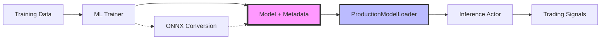

# ML Training-to-Inference Pipeline Documentation

## Overview
This document describes the complete ML pipeline from training models to serving them in production with Nautilus Trader's inference actors.

## Pipeline Architecture



## Key Components

### 1. Training Layer (`ml/training/`)

#### Base Components
- **`BaseMLTrainer`**: Abstract base class for all trainers
  - Handles data validation, feature engineering, metrics calculation
  - Currently uses pickle (being migrated to production formats)

- **`ModelExportMixin`**: Ensures production-ready exports
  - `save_for_production()`: Saves in ONNX or native format
  - `validate_inference_compatibility()`: Tests the complete pipeline
  - Never uses pickle for production models

#### Framework-Specific Trainers
- **`XGBoostTrainer`**:
  - Saves models in native `.json` format
  - Supports ONNX export via `export_to_onnx()`
  - Includes metadata with feature names and training metrics

- **`LightGBMTrainer`**:
  - Saves models in native `.txt` format
  - Supports ONNX export
  - Preserves categorical feature information

### 2. Model Persistence Layer (`ml/models/`)

#### Model Abstraction
- **`BaseModel`**: Abstract interface for all models
  - Consistent `predict()` method across all model types
  - Input validation via `validate_input()`
  - Metadata tracking

- **Framework Wrappers**:
  - `ONNXModel`: Handles ONNX runtime inference
  - `XGBoostModel`: Wraps XGBoost boosters
  - `LightGBMModel`: Wraps LightGBM boosters
  - `SklearnModel`: Wraps scikit-learn models

#### Saving Utilities (`ml/models/saver.py`)
- **`save_model_with_metadata()`**:
  ```python
  # Automatically detects model type and saves appropriately
  model_path = save_model_with_metadata(
      model=trained_model,
      path="models/my_model.xgb",
      input_shape=(None, n_features),
      training_metadata={
          "feature_names": feature_names,
          "training_metrics": metrics,
      }
  )
  ```
  - Creates model file + `.meta.json` metadata file
  - Never uses pickle unless forced (deprecated)

- **`convert_to_onnx()`**:
  ```python
  # Convert any supported model to ONNX
  onnx_path = convert_to_onnx(
      model=xgb_model,
      sample_input=X_sample,
      output_path="models/model.onnx"
  )
  ```

### 3. Model Loading Layer (`ml/models/loader.py`)

#### ProductionModelLoader
Primary loader for all production models:
```python
from ml.models.loader import ProductionModelLoader

loader = ProductionModelLoader()
model, metadata = loader.load_model("path/to/model.onnx")
```

**Supported formats**:
- **ONNX** (`.onnx`): Primary format for cross-platform deployment
- **XGBoost** (`.json`, `.xgb`): Native XGBoost format
- **LightGBM** (`.txt`, `.lgb`): Native LightGBM format
- **Pickle** (`.pkl`): REJECTED with clear error message

**Features**:
- Automatic format detection based on file extension
- Loads associated `.meta.json` metadata if available
- Returns standardized metadata structure
- Security-first: explicitly rejects pickle files

### 4. Inference Layer (`ml/actors/`)

#### BaseMLInferenceActor
Abstract base for ML inference actors:
- Loads models via `ProductionModelLoader`
- Handles feature computation
- Manages model hot-reloading
- Implements circuit breaker patterns

#### MLSignalActor
Production inference actor:
```python
config = MLSignalActorConfig(
    model_path="models/model.onnx",
    bar_type=bar_type,
    instrument_id=instrument_id,
    feature_config=feature_config,
)
actor = MLSignalActor(config)
```

## Complete Pipeline Example

### 1. Training Phase
```python
from ml.training.xgboost import XGBoostTrainer
from ml.config.xgboost import XGBoostTrainingConfig

# Configure training
config = XGBoostTrainingConfig(
    n_estimators=100,
    max_depth=5,
    objective="binary:logistic",
    save_model_path="models/xgb_model.json",
    export_to_onnx=True,
)

# Train model
trainer = XGBoostTrainer(config)
trainer.fit(X_train, y_train, feature_names=feature_names)

# Save in production format
trainer.save_model("models/xgb_model.json")  # Native format
trainer.export_to_onnx("models/xgb_model.onnx")  # ONNX format
```

### 2. Loading Phase
```python
from ml.models.loader import ProductionModelLoader

# Load model with metadata
loader = ProductionModelLoader()
model, metadata = loader.load_model("models/xgb_model.json")

# Metadata includes:
# - model type, version, size
# - feature names from training
# - training metrics
# - input/output shapes
```

### 3. Inference Phase
```python
from ml.actors.signal import MLSignalActor

# Configure actor with trained model
actor_config = MLSignalActorConfig(
    model_path="models/xgb_model.onnx",
    bar_type=bar_type,
    instrument_id=instrument_id,
    feature_config=feature_config,  # Must match training
)

# Actor loads model via ProductionModelLoader
actor = MLSignalActor(actor_config)

# In backtest/live trading
engine.add_actor(actor)
```

## Model Format Decision Tree

```
Is it for production use?
├── YES
│   ├── Need cross-platform? → ONNX
│   ├── XGBoost only? → Native .json
│   ├── LightGBM only? → Native .txt
│   └── Other? → Convert to ONNX
└── NO (testing only)
    └── Use PickleModelLoader (shows deprecation warning)
```

## Security Considerations

### What's Allowed
- ✅ ONNX format (secure, sandboxed execution)
- ✅ XGBoost native format (JSON-based, safe)
- ✅ LightGBM native format (text-based, safe)

### What's Blocked
- ❌ Pickle format (arbitrary code execution risk)
- ❌ Joblib format (same risks as pickle)
- ❌ Any unknown format

### Error Messages
When attempting to load pickle files:
```
ValueError: Pickle format not supported for security reasons.
Please export your model to ONNX or native format.
File: /path/to/model.pkl
```

## Metadata Structure

Every saved model includes a `.meta.json` file:
```json
{
  "model_type": "xgboost",
  "path": "/path/to/model.json",
  "version": "a1b2c3d4",
  "size_bytes": 12345,
  "modified_time": 1234567890.123,
  "input_shape": [null, 26],
  "output_shape": [null, 1],
  "training_metadata": {
    "feature_names": ["sma_10", "rsi_14", ...],
    "training_accuracy": 0.95,
    "training_auc": 0.88,
    "trainer_class": "XGBoostTrainer"
  }
}
```

## Testing the Pipeline

```python
from ml.tests.test_training_inference_pipeline import TestTrainingInferencePipeline

# Run all pipeline tests
pytest ml/tests/test_training_inference_pipeline.py -v

# Tests verify:
# 1. Models can be saved in production formats
# 2. ProductionModelLoader can load all formats
# 3. Metadata is preserved through the pipeline
# 4. Predictions work with loaded models
# 5. Security: pickle files are rejected
```

## Migration Guide

### For Existing Code Using Pickle
```python
# OLD (insecure)
with open("model.pkl", "wb") as f:
    pickle.dump(model, f)

# NEW (secure)
from ml.models.saver import save_model_with_metadata
save_model_with_metadata(
    model=model,
    path="model.onnx",  # or .json for XGBoost
    input_shape=(None, n_features),
    training_metadata={"feature_names": features}
)
```

### For Loading Models
```python
# OLD (insecure)
with open("model.pkl", "rb") as f:
    model = pickle.load(f)

# NEW (secure)
from ml.models.loader import ProductionModelLoader
loader = ProductionModelLoader()
model, metadata = loader.load_model("model.onnx")
```

## Performance Considerations

### Model Format Performance
1. **Native formats** (XGBoost .json, LightGBM .txt):
   - Fastest loading time
   - No conversion overhead
   - Best for same-framework inference

2. **ONNX format**:
   - Slightly slower initial load
   - Optimized inference via ONNX Runtime
   - Hardware acceleration available
   - Best for cross-platform deployment

### Inference Optimization
- Models are loaded once at actor initialization
- Feature computation is pre-allocated (numpy arrays)
- ONNX Runtime optimizations enabled for production
- Circuit breaker prevents cascade failures

## Future Enhancements

1. **Model Versioning**: Git-like version control for models
2. **A/B Testing**: Multiple models with traffic splitting
3. **Model Registry**: Centralized model storage and discovery
4. **Monitoring**: Automated drift detection and alerts
5. **Auto-retraining**: Scheduled retraining pipelines
