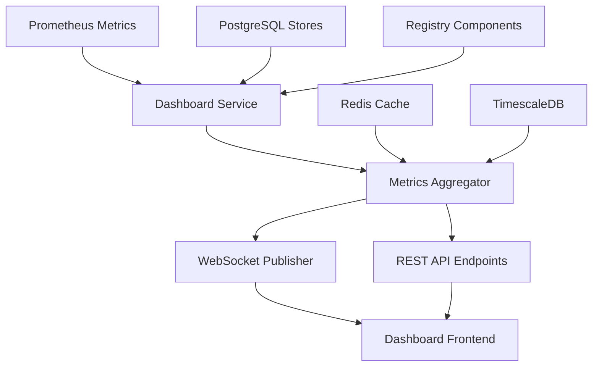

# Dashboard Metrics & Monitoring Implementation Plan

## Executive Summary

This document provides a comprehensive implementation plan for the Nautilus Trader ML Dashboard's metrics and monitoring displays. The plan covers five key UI elements with their data sources, update mechanisms, and performance optimization strategies.

## 1. Key Performance Indicators (KPI) Cards

### UI Elements
- **Daily P&L**: Real-time profit & loss calculation
- **Sharpe Ratio**: Risk-adjusted return metric
- **Win Rate**: Percentage of profitable trades
- **Max Drawdown**: Maximum peak-to-trough decline
- **Active Models**: Count of deployed and active models

### Data Sources
- **Primary**: `ml_strategy_signals` table for signal performance
- **Secondary**: `ml_model_predictions` table for model accuracy
- **Tertiary**: `ml_strategy_performance` table for aggregated metrics
- **Metrics**: `nautilus_ml_strategy_pnl` gauge, `nautilus_ml_model_accuracy` gauge

### Implementation Strategy
```python
# Data aggregation approach
def collect_kpi_metrics():
    # Daily P&L from strategy signals and model predictions
    pnl_query = """
    SELECT SUM(strength * CASE signal_type
               WHEN 'BUY' THEN 1
               WHEN 'SELL' THEN -1
               ELSE 0 END) as daily_pnl
    FROM ml_strategy_signals
    WHERE DATE(to_timestamp(ts_event / 1000000000)) = CURRENT_DATE
    """

    # Win rate from successful signals
    win_rate_query = """
    SELECT COUNT(CASE WHEN strength > 0.7 THEN 1 END) * 100.0 / COUNT(*) as win_rate
    FROM ml_strategy_signals
    WHERE ts_event >= EXTRACT(EPOCH FROM (CURRENT_DATE - INTERVAL '7 days')) * 1000000000
    """
```

### Update Frequency & Caching
- **Real-time updates**: Every 30 seconds via WebSocket
- **Cache TTL**: 15 seconds for hot-path metrics
- **Fallback**: 2-minute polling if WebSocket fails
- **Aggregation**: Pre-computed daily/weekly/monthly rollups

### Performance Optimization
- Use materialized views for heavy aggregations
- Implement BRIN indexes on time-partitioned tables
- Cache expensive calculations in Redis with 1-minute TTL

## 2. Live Data Ingestion Monitor

### UI Elements
- **Bars/sec**: Real-time bar data throughput
- **Quotes/sec**: Quote data ingestion rate
- **L2 Updates/sec**: Level 2 order book updates
- **Data Quality Score**: Overall data health percentage

### Data Sources
- **Primary**: `ml_data_events` table with `stage='INGESTED'`
- **Metrics**: `nautilus_ml_data_events_total` counter
- **Real-time**: Direct metrics scraping from Prometheus

### Implementation Strategy
```python
# Real-time ingestion monitoring
def get_ingestion_rates():
    # Use Prometheus rate() function for per-second calculations
    queries = {
        'bars_per_sec': 'rate(nautilus_ml_data_events_total{dataset_type="BARS"}[1m])',
        'quotes_per_sec': 'rate(nautilus_ml_data_events_total{dataset_type="QUOTES"}[1m])',
        'l2_updates_per_sec': 'rate(nautilus_ml_data_events_total{dataset_type="MBP1"}[1m])',
        'data_quality': 'avg(nautilus_ml_data_quality_score)'
    }
    return prometheus_helper.collect_scalars(queries)
```

### Update Frequency & Caching
- **Real-time updates**: Every 5 seconds via WebSocket
- **Cache TTL**: 10 seconds for ingestion rates
- **Metrics collection**: Direct Prometheus API calls
- **Historical data**: 1-hour retention for trend analysis

### Performance Optimization
- Use time-series database (TimescaleDB) extensions
- Implement sliding window aggregations
- Pre-calculate 1m/5m/15m rate windows

## 3. Portfolio & Active Positions

### UI Elements
- **Total Value**: Portfolio market value
- **Cash**: Available cash balance
- **Margin Used**: Current margin utilization
- **Positions Count**: Number of active positions

### Data Sources
- **Primary**: `ml_strategy_signals` table for position tracking
- **Secondary**: Real-time position data from Nautilus core
- **Metrics**: `nautilus_ml_strategy_pnl` gauge for portfolio value

### Implementation Strategy
```python
# Portfolio aggregation with real-time updates
def get_portfolio_summary():
    # Aggregate from strategy signals and live positions
    portfolio_query = """
    SELECT
        COUNT(DISTINCT instrument_id) as active_positions,
        SUM(CASE WHEN signal_type = 'BUY' THEN strength ELSE 0 END) as long_exposure,
        SUM(CASE WHEN signal_type = 'SELL' THEN strength ELSE 0 END) as short_exposure
    FROM ml_strategy_signals
    WHERE is_live = TRUE AND ts_event > %s
    """
    return execute_with_fallback(portfolio_query, fallback_cache_key='portfolio')
```

### Update Frequency & Caching
- **Real-time updates**: Every 10 seconds for portfolio value
- **Position updates**: Every 30 seconds for position counts
- **Cache TTL**: 30 seconds with stale-while-revalidate pattern
- **WebSocket**: Live position updates from trading engine

### Performance Optimization
- Maintain in-memory position cache
- Use event-driven updates from trading signals
- Implement position reconciliation every 5 minutes

## 4. System Health & Resources

### UI Elements
- **PostgreSQL**: Database connection and query performance
- **Redis**: Cache hit rates and memory usage
- **ONNX Runtime**: Model inference latency and throughput
- **Feature Store**: Store health and data freshness

### Data Sources
- **Primary**: `store_health.py` module functions
- **Secondary**: Direct health checks via store protocols
- **Metrics**: Dashboard-specific metrics from `metrics_snapshot.py`

### Implementation Strategy
```python
# Unified system health monitoring
def get_system_health():
    stores = summarize_all_stores(
        feature_store=feature_store_client,
        model_store=model_store_client,
        strategy_store=strategy_store_client,
        engine=db_engine,
        top_dataset_limit=5
    )

    # Additional resource monitoring
    resource_stats = {
        'postgresql': check_db_performance(),
        'redis': check_cache_performance(),
        'onnx_runtime': check_inference_performance(),
        'feature_store': stores[0].as_dict()  # Feature store is first
    }
    return resource_stats
```

### Update Frequency & Caching
- **Health checks**: Every 60 seconds (cold path)
- **Critical metrics**: Every 15 seconds for alerts
- **Cache TTL**: 45 seconds with progressive fallback
- **Circuit breaker**: Disable failing health checks temporarily

### Performance Optimization
- Use connection pooling for database health checks
- Implement health check timeouts (5 seconds max)
- Cache health results with exponential backoff on failures

## 5. Active Experiments Section

### UI Elements
- **Hyperparameter Optimization**: Running HPO jobs status
- **Feature Selection**: Active feature engineering experiments
- **Architecture Search**: Model architecture experiments

### Data Sources
- **Primary**: MLflow/experiment tracking integration
- **Secondary**: `ml_model_predictions` table for A/B test results
- **Registry**: ModelRegistry and FeatureRegistry for experiment metadata

### Implementation Strategy
```python
# Experiment tracking integration
def get_active_experiments():
    # Query running experiments from registry
    experiments = {
        'hyperparameter_opt': model_registry.list_experiments(status='running', type='hpo'),
        'feature_selection': feature_registry.list_experiments(status='active'),
        'architecture_search': model_registry.list_experiments(status='running', type='nas')
    }

    # Enrich with performance metrics
    for exp_type, exp_list in experiments.items():
        for exp in exp_list:
            exp['metrics'] = get_experiment_metrics(exp['experiment_id'])

    return experiments
```

### Update Frequency & Caching
- **Experiment status**: Every 2 minutes (experiments are long-running)
- **Performance metrics**: Every 30 seconds for active experiments
- **Cache TTL**: 90 seconds for experiment lists
- **Event-driven**: Updates on experiment state changes

### Performance Optimization
- Use experiment registry caching
- Implement lazy loading for experiment details
- Pre-compute experiment performance summaries

## Architecture Overview

### Metrics Collection Architecture



### Real-time Update Mechanism

**WebSocket Implementation:**
```python
# WebSocket event publisher for real-time updates
class DashboardWebSocketPublisher:
    def __init__(self, update_interval: float = 5.0):
        self.clients = set()
        self.update_interval = update_interval

    async def publish_metrics_update(self):
        while True:
            try:
                metrics = await self.collect_all_metrics()
                message = {
                    'type': 'metrics_update',
                    'timestamp': time.time(),
                    'data': metrics
                }
                await self.broadcast(message)
                await asyncio.sleep(self.update_interval)
            except Exception as e:
                logger.error(f"Metrics update failed: {e}")
                await asyncio.sleep(self.update_interval * 2)  # Backoff
```

### Store Integration Patterns

**Progressive Fallback Chain:**
1. **PostgreSQL + Redis**: Primary data path with caching
2. **PostgreSQL Only**: Fallback when Redis unavailable
3. **DummyStore**: Final fallback with warning logs
4. **Cached Data**: Serve stale data if all stores fail

**Health Monitoring Integration:**
```python
# Store health integration with dashboard metrics
def integrate_store_health():
    stores_health = get_store_summary()

    # Update dashboard-specific metrics
    for store_data in stores_health['stores']:
        store_name = store_data['store']
        healthy = store_data['healthy']
        age_seconds = store_data.get('age_seconds', 0)

        # Export to Prometheus for alerting
        store_health_gauge.labels(store=store_name).set(1 if healthy else 0)
        store_age_gauge.labels(store=store_name).set(age_seconds or 0)
```

### Performance Optimization Approach

**Caching Strategy:**
- **L1 Cache**: In-memory Python dictionaries (1-60 seconds TTL)
- **L2 Cache**: Redis with JSON serialization (1-15 minutes TTL)
- **L3 Cache**: PostgreSQL materialized views (hourly refresh)

**Query Optimization:**
- Use BRIN indexes for time-series queries on partitioned tables
- Implement query result pagination for large datasets
- Pre-aggregate heavy computations in background jobs

**Resource Management:**
- Connection pooling for all database connections
- Async I/O for concurrent metric collection
- Circuit breakers for external service calls

### WebSocket vs Polling Tradeoffs

**WebSocket Advantages:**
- Lower latency for real-time updates
- Reduced server load from polling
- Better user experience for live monitoring

**WebSocket Challenges:**
- Connection state management complexity
- Firewall/proxy compatibility issues
- Higher memory usage per connection

**Hybrid Approach (Recommended):**
```python
# Implement both WebSocket and polling fallback
class DashboardUpdater:
    def __init__(self):
        self.websocket_enabled = True
        self.polling_interval = 30  # Fallback polling

    async def start_updates(self):
        if self.websocket_enabled:
            try:
                await self.websocket_updater()
            except WebSocketError:
                logger.warning("WebSocket failed, falling back to polling")
                await self.polling_updater()
        else:
            await self.polling_updater()
```

## Implementation Priorities

### Phase 1: Core Infrastructure (Week 1-2)
1. Implement metrics collection service
2. Set up WebSocket infrastructure
3. Create basic store health monitoring
4. Implement caching layer

### Phase 2: KPI Dashboard (Week 3-4)
1. Build KPI calculation engine
2. Implement real-time P&L tracking
3. Create portfolio monitoring
4. Add basic alerting

### Phase 3: Advanced Monitoring (Week 5-6)
1. Implement data ingestion monitoring
2. Add system health displays
3. Create experiment tracking integration
4. Performance optimization

### Phase 4: Production Hardening (Week 7-8)
1. Add comprehensive error handling
2. Implement monitoring alerting
3. Performance testing and optimization
4. Documentation and runbooks

## Monitoring and Alerting

**Key Metrics to Monitor:**
- Dashboard API latency (< 500ms P95)
- WebSocket connection count and stability
- Cache hit ratios (> 80% for L1/L2 caches)
- Store health check success rates (> 95%)

**Alert Thresholds:**
- Portfolio P&L change > 5% in 1 hour
- Data ingestion rate drops > 50% for 5 minutes
- System health checks failing for > 2 minutes
- WebSocket connections dropping > 20% in 1 minute

This implementation plan provides a comprehensive roadmap for building a robust, real-time dashboard monitoring system that integrates seamlessly with the Nautilus Trader ML infrastructure.