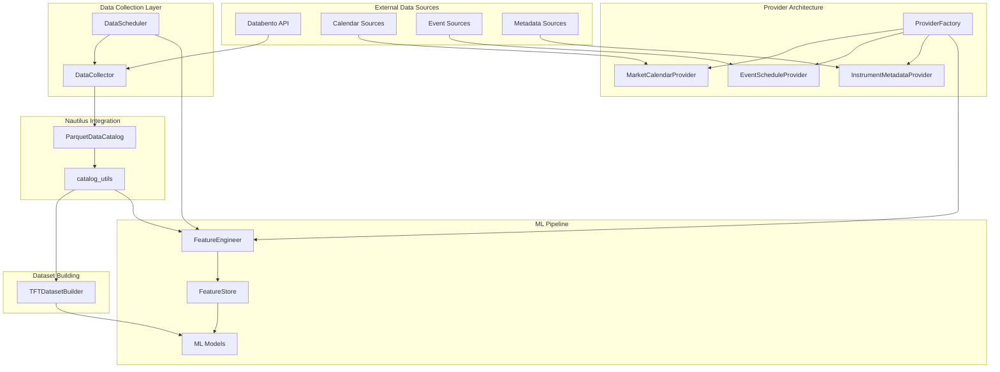
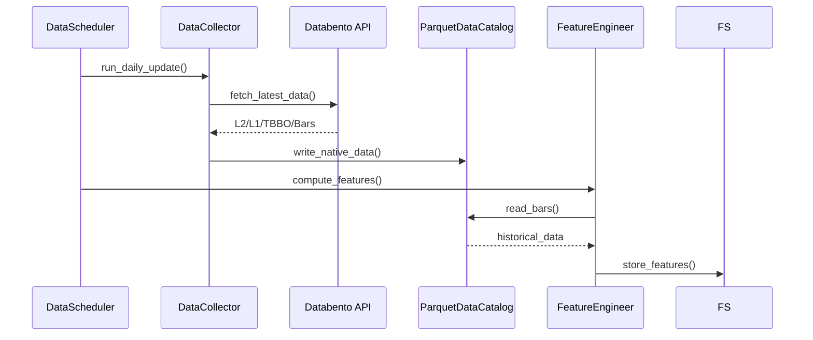
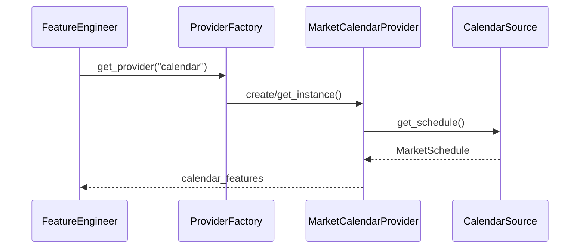

# ML Data Module Context Document

## Executive Summary

The `ml/data/` module provides a comprehensive data pipeline infrastructure for machine learning workflows within Nautilus Trader. The module has been refactored to eliminate redundant components and use Nautilus native components directly, following a clean architecture with clear separation of concerns.

Operational notes:
- Timestamps: All pipeline timestamps are UNIX nanoseconds. Store write paths perform defensive normalization from seconds/ms/us to ns and log a warning if triggered. See `context_stores.md` → "Timestamp Policy & Normalization".
- DB readiness: Apply canonical migrations and run a DB preflight before running ingestion/backfills to ensure required functions and partitions exist. See `context_deployment.md`.

**Key Components:**

- **Data Collection**: Enhanced `DataCollector` for Databento API integration with multi-tier data collection strategy
- **Data Utilities**: Helper functions working directly with `ParquetDataCatalog`
- **Scheduling**: Production-ready automated data collection and processing via `DataScheduler` with DataRegistry integration
- **TFT Dataset Building**: Training data preparation with FeatureStore integration for training/inference parity
- **Provider Architecture**: Extensible data provider system for static and time-series features
- **Alternative Data Loaders**: FRED economic indicators loader for macro features

**Implementation Status**: ~95% complete, production-ready with comprehensive metrics and monitoring

## Architecture Overview



## Component Breakdown

### 1. Data Collection (`collector.py`)

**Purpose**: Enhanced data collector optimizing Databento subscription value with multi-tier collection strategy.

**Class**: `DataCollector`

**I/O Specifications**:

- **Input**:
  - `storage_limit_gb`: Maximum storage budget (default: 500GB)
  - `data_dir`: Output directory for collected data
  - Databento API key via `DATABENTO_API_KEY` environment variable
- **Output**: Raw market data files in Parquet format
- **Storage**: Organized by symbol and data type under `data/enhanced/`

**Key Features**:

- **Prioritized Collection Strategy**:
  - L2 market depth (mbp-1): 30 days for top 50 liquid symbols
  - L1 trades: 2+ years for top 20 priority symbols
  - TBBO quotes: 30 days for spread dynamics
  - Minute bars: 1 year coverage for all symbols
- **Smart Storage Management**:
  - Real-time storage tracking
  - Automatic phase adjustment based on available space
  - Collection metadata JSON output
- **Priority Symbols**: SPY, QQQ, IWM, AAPL, MSFT, NVDA, etc.

**Methods**:
- `collect_l2_depth(symbols, days)`: Collect L2 market depth data
- `collect_l1_trades(symbols, years)`: Collect historical trades
- `collect_tbbo_quotes(symbols, days)`: Collect top-of-book quotes
- `collect_minute_bars(symbols, days)`: Collect OHLCV bars
- `run_collection()`: Execute complete collection pipeline

**Current Status**: ✅ Complete implementation

- Storage estimation with liquidity adjustments
- Comprehensive error handling and rate limiting
- Configurable collection phases
- Statistics tracking and reporting
- Collection metadata persistence

**Critical Issues**: None identified - production ready

### 2. Data Utilities (`catalog_utils.py`)

**Purpose**: Helper functions for direct ParquetDataCatalog integration.

**I/O Specifications**:

```python
def bars_to_dataframe(
    catalog: ParquetDataCatalog,
    instrument_ids: list[str],
    start: datetime | str | None = None,
    end: datetime | str | None = None,
) -> pl.DataFrame
```

**Schema Specifications**:

- **Bars**: instrument_id, timestamp, open, high, low, close, volume
- **Quotes**: instrument_id, timestamp, bid, ask, bid_size, ask_size
- **Trades**: instrument_id, timestamp, price, size, aggressor_side

**Current Status**: ✅ Complete implementation

- Full type safety with mypy strict compliance
- Polars DataFrame outputs for performance
- Graceful error handling with empty DataFrames
- Nautilus-native instrument ID handling

**Dependencies**:

- `nautilus_trader.persistence.catalog.parquet.ParquetDataCatalog`
- `polars` (checked via `ml._imports`)

### 3. Data Scheduling (`scheduler.py`)

**Purpose**: Production-ready automated data collection and processing with comprehensive monitoring.

**Class**: `DataScheduler`

**I/O Specifications**:

- **Input**:
  - `catalog`: ParquetDataCatalog for data storage
  - `config`: SchedulerConfig with Databento settings
  - `collector`: DataCollector instance (optional)
  - `feature_engineer`: FeatureEngineer for feature computation (optional)
  - `metrics_port`: Port for Prometheus metrics server
- **Output**:
  - Updated ParquetDataCatalog with new market data
  - Computed features persisted to FeatureStore
  - DataRegistry events for pipeline tracking
  - Prometheus metrics for monitoring

**Current Status**: ✅ Complete production implementation

**Key Features**:

- **DataRegistry Integration**:
  - Emits CATALOG_WRITTEN events for data lineage (with optional event metadata)
  - Updates watermarks for dataset freshness tracking
  - Supports both PostgreSQL and JSON backends
- **Comprehensive Metrics** (15+ Prometheus metrics):
  - `data_collection_latency`: Collection time by instrument
  - `pipeline_stage_latency`: Stage execution times
  - `catalog_write_operations_total`: Catalog write success/failure
  - `feature_store_operations_total`: Feature store operations
  - `data_staleness_seconds`: Data freshness tracking
  - `api_rate_limit_hits`: API rate limit monitoring
- **Databento Integration**:
  - Configurable schemas (ohlcv-1m, trades, mbp-1, tbbo)
  - Temporary file support for large datasets
  - Automatic retry with exponential backoff
  - Rate limiting compliance
- **Feature Computation**:
  - Automatic feature computation after data collection
  - FeatureStore persistence for training/inference parity
  - Support for batch processing of multiple instruments

**Methods**:
- `run_daily_update()`: Complete daily pipeline execution
- `_collect_latest_data()`: Fetch data from Databento
- `_collect_symbol_data()`: Per-symbol collection with metrics
- `_compute_features()`: Trigger feature computation
- `_clean_old_data()`: Data retention management
- `_load_from_dbn_file()`: DBN file processing

**Integration Points**:

- DataCollector → ParquetDataCatalog → FeatureEngineer → FeatureStore
- DataRegistry for event tracking and watermark management
- Prometheus metrics server for observability
- Database health views for pipeline monitoring

### 4. TFT Dataset Builder (`tft_dataset_builder.py`)

**Purpose**: Training dataset preparation with automatic source selection for TFT models.

**Class**: `TFTDatasetBuilder`

**I/O Specifications**:

- **Input**:
  - `catalog`: ParquetDataCatalog for raw data access
  - `symbols`: List of symbols to include
  - `feature_config`: MLFeatureConfig for feature engineering
  - `feature_store`: FeatureStore for pre-computed features (optional)
- **Output**: TFT-compatible DataFrame (Pandas or Polars)

**Key Methods**:

- `prepare_training_data_from_store()`: Load features from FeatureStore
  - Ensures training/inference parity
  - Combines FeatureStore features with bar data for targets
  - Adds TFT-specific features (static, known-future)

- `prepare_training_data()`: Smart source selection
  - Automatically uses FeatureStore if available
  - Falls back to direct computation with logging
  - Returns Polars or Pandas DataFrame based on preference

- `_build_training_dataset_direct()`: Direct feature computation
  - Computes features from raw bar data
  - Used when FeatureStore is unavailable

**Feature Categories**:

1. **Technical Features** (from FeatureStore or computed):
   - Returns (1, 5, 20 periods)
   - Volume ratios
   - Volatility measures
   - Moving averages
   - Price position indicators

2. **Static Covariates**:
   - Asset class
   - Tick size
   - Exchange identifier

3. **Known-Future Features**:
   - Cyclic time encodings (hour, day-of-week)
   - Market session indicators
   - Calendar features

4. **Targets**:
   - Binary classification (configurable threshold)
   - Forward returns

**Current Status**: ✅ Complete with dual-source support

- **FeatureStore Integration**: Priority source for training/inference parity
- **Automatic Fallback**: Graceful degradation to direct computation
- **Performance**: Optimized batch processing for large datasets
- **Format Support**: Both Polars and Pandas DataFrames

### 5. Provider Architecture

#### Base Classes (`providers/base.py`)

**Purpose**: SOLID-principle abstractions for data providers.

**Protocols**:

- `DataProvider`: Core interface for all providers
- `CacheableProvider`: Caching capability
- `StaticDataProvider`: Time-invariant data
- `TimeSeriesProvider`: Time-varying data

**Base Implementations**:

- `BaseDataProvider`: Common functionality (logging, metrics, validation)
- `CachedDataProvider`: Template method with caching
- `BaseStaticProvider`: Static data with indefinite caching
- `BaseTimeSeriesProvider`: Time series validation

**Current Status**: ✅ Complete implementation

- Full protocol compliance with runtime checks
- Comprehensive validation and error handling
- Metrics collection integration
- Cache management with TTL support

#### Calendar Provider (`providers/calendar.py`)

**Purpose**: Market calendar features for time-based ML inputs.

**Features Generated**:

```python
{
    "timestamp": int,
    "is_trading_day": bool,
    "is_pre_market": bool,
    "is_after_hours": bool,
    "minutes_to_close": int,
    "hour_sin": float,         # Cyclic encodings
    "hour_cos": float,
    "dow_sin": float,
    "dow_cos": float,
    "month_sin": float,
    "month_cos": float,
    "is_weekend": bool,
    "is_month_start": bool,
    "is_month_end": bool,
    "is_quarter_start": bool,
    "is_quarter_end": bool,
    "days_to_month_end": int,
    "days_from_month_start": int,
}
```

**Current Status**: ✅ Complete implementation

- Exchange-specific trading hours
- Holiday calendar integration
- Graceful fallbacks for missing calendar data
- Suitable for TFT known-future inputs

#### Event Provider (`providers/events.py`)

**Purpose**: Scheduled market events (earnings, economic releases).

**Features Generated**:

```python
{
    "timestamp": int,
    "has_fed_event_today": bool,
    "has_cpi_event_today": bool,
    "has_earnings_today": bool,
    "days_to_next_fed": int,
    "days_to_next_cpi": int,
    "days_to_next_earnings": int,
    "days_since_last_fed": int,
    "days_since_last_cpi": int,
    "days_since_last_earnings": int,
    "event_importance_score": float,
    "event_clustering_score": float,
}
```

**Current Status**: ✅ Complete implementation

- Economic event tracking (Fed, CPI, NFP)
- Earnings calendar integration
- Event importance scoring
- Temporal relationship features

#### Metadata Provider (`providers/metadata.py`)

**Purpose**: Static instrument specifications for ML static covariates.

**Features Generated**:

```python
{
    "instrument_id": str,
    "tick_size": float,
    "lot_size": float,
    "contract_size": float,
    "min_price_increment": float,
    "exchange": str,
    "asset_class": str,
    "currency": str,
    "margin_initial": float,
    "margin_maintenance": float,
    "fee_class": str,
    "market_segment": str,
}
```

**Current Status**: ✅ Complete implementation

- Schema validation and error handling
- Caching for static data
- Default value fallbacks
- Suitable for TFT static covariates

#### Provider Factory (`providers/factory.py`)

**Purpose**: Factory pattern for provider creation and management.

**Current Status**: ✅ Complete implementation

- Singleton pattern for provider instances
- Source injection for testing
- Custom provider registration
- Transform-to-provider mapping

#### Provider Utilities (`providers/utils.py`)

**Purpose**: Pure functions for common calculations.

**Functions**:

- `cyclic_encode()`: Sin/cos encoding for cyclic features
- `time_to_event()`: Time calculations for event features
- `validate_timestamps()`: Timestamp validation
- `align_timeseries()`: DataFrame alignment utilities

**Current Status**: ✅ Complete implementation

- Functional programming principles
- Comprehensive docstrings with examples
- Type safety and validation

### 6. Data Sources

#### Calendar Sources (`sources/calendar.py`)

**Purpose**: Abstract and concrete calendar data sources.

**Implementations**:

- `MockCalendarSource`: Testing with realistic schedules
- `SimpleCalendarSource`: Basic NYSE schedule
- `PandasMarketCalendarSource`: Real market calendar integration

**Current Status**: ✅ Complete implementation with real calendar provider

- **Implemented**: Real calendar source using `pandas_market_calendars`
- Full support for NYSE, NASDAQ, CME, and other major exchanges
- Holiday calendar integration
- Trading hours and session information

#### Event Sources (`sources/events.py`)

**Purpose**: Economic and earnings event sources.

**Implementations**:

- `MockEventSource`: Realistic synthetic events
- `SimpleEventSource`: Fixed calendar events

**Current Status**: ✅ Complete mock implementations

- **TODO**: Real event source integration (e.g., Alpha Vantage, FMP)

#### Metadata Sources (`sources/metadata.py`)

**Purpose**: Instrument metadata sources.

**Implementations**:

- `MockMetadataSource`: Synthetic realistic metadata
- `DatabentoMetadataSource`: Databento API integration (partial)
- `NautilusMetadataSource`: Nautilus instrument extraction
- `CSVMetadataSource`: File-based metadata

**Current Status**: 🔶 Framework complete, partial implementations

- Mock source: ✅ Complete
- CSV source: ✅ Complete
- Nautilus source: ✅ Complete
- Databento source: 🔶 Stub implementation

## Data Flow Diagrams

### Collection Flow



### Provider Flow



## Configuration Requirements

### Environment Variables

```bash
DATABENTO_API_KEY=<your_api_key>  # Required for data collection
```

### Dependencies

```python
# Core dependencies (always required)
nautilus_trader  # ParquetDataCatalog, instrument types
polars          # DataFrame operations (checked via ml._imports)

# Optional dependencies (feature-gated)
databento       # Data collection (lazy import)
pandas          # Alternative DataFrame format
numpy           # Numerical operations
```

### File Structure

```
data/
├── enhanced/           # Enhanced collection output
│   ├── SPY/
│   │   ├── l2_depth_30d.parquet
│   │   ├── trades_2024.parquet
│   │   ├── tbbo_30d.parquet
│   │   └── bars_1m_365d.parquet
│   └── collection_metadata.json
└── universe/           # Basic universe data
    └── [existing Nautilus data]
```

## Integration Points with Nautilus Trader

### Core Integration

- **ParquetDataCatalog**: Direct usage for data storage/retrieval
- **InstrumentId**: Native type handling in utilities
- **Bar/QuoteTick/TradeTick**: Native type outputs from collector
- **Timestamp Handling**: Nanosecond precision (ts_event, ts_init)

### ML Infrastructure Integration

- **FeatureStore**: Target for computed features
- **ModelStore**: Model predictions and performance
- **StrategyStore**: Trading decisions and state
- **Registry System**: Feature/model/strategy registration

### Actor Integration

- **BaseMLInferenceActor**: Required base for all ML actors
- **MLSignalActor**: Signal generation with built-in features
- **MLTradingStrategy**: Full trading strategies

## Error Handling Patterns

### Graceful Degradation

```python
# Example from catalog_utils.py
if not bars:
    # Return empty DataFrame with expected schema
    return pl.DataFrame({
        "instrument_id": [],
        "timestamp": [],
        "open": [], "high": [], "low": [], "close": [], "volume": [],
    })
```

### Provider Fallbacks

```python
# Example from providers
try:
    data = self.source.fetch_data(params)
except Exception as e:
    logger.error(f"Source failed: {e}")
    return self._default_data(params)  # Safe fallback
```

### Validation Patterns

```python
# Validate before processing
if not self.validate_data(data):
    logger.warning("Data validation failed")
    return False

# Type checking with runtime validation
@runtime_checkable
class DataProvider(Protocol):
    def load_data(...) -> pl.DataFrame: ...
```

## Current State Assessment

### Production Ready ✅

- **catalog_utils.py**: Complete with type-safe Nautilus integration
- **collector.py**: Full Databento integration with multi-tier collection strategy
- **scheduler.py**: Production implementation with DataRegistry, metrics, and monitoring
- **tft_dataset_builder.py**: Dual-source support with FeatureStore priority
- **fred_loader.py**: Complete FRED API integration with caching and DataStore
- **Provider architecture**: Complete abstractions and factory pattern
- **Calendar provider**: Real implementation using `pandas_market_calendars`
- **Metadata provider**: Multiple sources (Mock, CSV, Nautilus)
- **Event provider**: Mock implementation with extensible framework

### Recently Completed 🎯

- **DataRegistry Integration**: Full event emission and watermark tracking in scheduler
- **FRED Data Loader**: Complete economic indicator integration
- **FeatureStore Priority**: TFTDatasetBuilder automatically uses FeatureStore
- **Comprehensive Metrics**: 15+ Prometheus metrics across all components
- **Production Monitoring**: Metrics server integration in scheduler

### Framework Complete, Implementation Needed 🔶

- **Databento metadata source**: Stub exists, needs API implementation
- **Real event sources**: Framework ready for Alpha Vantage, FMP integration
- **Additional data loaders**: Framework supports Yahoo, IB, Binance (not implemented)

### Integration Points Working ✅

- **DataCollector → ParquetDataCatalog**: Full integration
- **DataScheduler → FeatureStore**: Automatic feature persistence
- **DataScheduler → DataRegistry**: Event tracking and watermarks
- **FREDLoader → DataStore**: Economic indicators storage
- **TFTDatasetBuilder → FeatureStore**: Training/inference parity

## Critical Issues and Gaps

### Recently Resolved ✅

1. **Databento API Integration**: Full implementation in scheduler.py
2. **Production Calendar Sources**: Real calendar provider using pandas_market_calendars
3. **FeatureStore Integration**: Automatic feature persistence from scheduler
4. **Metrics Integration**: 15+ Prometheus metrics implemented
5. **Docker Deployment**: Complete ML pipeline containerization

### High Priority (Remaining)

1. **Event Source Integration**: Need real economic/earnings APIs
2. **Data Retention Policies**: Cleanup logic framework exists but not automated
3. **Error Recovery**: Collection failure handling could be enhanced

### Medium Priority

1. **Caching Strategy**: Provider cache TTL and invalidation
2. **Schema Evolution**: Backward compatibility for data format changes
3. **Performance Optimization**: Large dataset handling
4. **Documentation**: API documentation and examples

### Low Priority

1. **Additional Providers**: More specialized data sources
2. **Custom Transforms**: User-defined feature calculations
3. **Data Quality Checks**: Outlier detection and validation
4. **Compression**: Storage optimization strategies

## API Reference

### Core Functions

```python
# Data loading utilities
from ml.data import bars_to_dataframe, quotes_to_dataframe, trades_to_dataframe

# Load bars data
bars_df = bars_to_dataframe(
    catalog=catalog,
    instrument_ids=["SPY.NYSE", "AAPL.NASDAQ"],
    start=datetime(2024, 1, 1),
    end=datetime(2024, 12, 31)
)

# Dataset building with FeatureStore
from ml.data.tft_dataset_builder import TFTDatasetBuilder
from ml.stores.feature_store import FeatureStore

feature_store = FeatureStore(connection_string="postgresql://...")
builder = TFTDatasetBuilder(
    catalog=catalog,
    symbols=["SPY", "AAPL"],
    feature_store=feature_store  # Optional - enables parity
)

# Automatic source selection (FeatureStore if available)
dataset = builder.prepare_training_data(
    start=datetime(2024, 1, 1),
    horizon_minutes=15,
    use_polars=True
)

# Data collection
from ml.data.collector import DataCollector

collector = DataCollector(storage_limit_gb=500)
collector.run_collection()  # Multi-phase collection

# Scheduling with full integration
from ml.data.scheduler import DataScheduler
from ml.config.scheduler_config import SchedulerConfig

config = SchedulerConfig(
    symbols=["SPY.XNYS", "AAPL.XNAS"],
    feature_store_enabled=True
)
scheduler = DataScheduler(
    catalog=catalog,
    config=config,
    feature_engineer=feature_engineer,
    metrics_port=8000
)
scheduler.run_daily_update()

# FRED data loading
from ml.data.loaders.fred_loader import FREDConfig, FREDDataLoader

fred_config = FREDConfig()  # Uses FRED_API_KEY env var
fred_loader = FREDDataLoader(fred_config)
fred_loader.store_indicators(data_store, data_registry)

# Provider factory
from ml.data.providers.factory import ProviderFactory

factory = ProviderFactory()
calendar_provider = factory.get_calendar_provider()
metadata_provider = factory.get_metadata_provider()
```

### Configuration Classes

```python
from ml.config.base import MLFeatureConfig
from ml.config.scheduler_config import SchedulerConfig, DatabentoConfig
from ml.data.loaders.fred_loader import FREDConfig

# Feature configuration
feature_config = MLFeatureConfig(
    lookback_periods=30,
    feature_groups=["price", "volume", "microstructure"]
)

# Scheduler configuration
scheduler_config = SchedulerConfig(
    symbols=["SPY.XNYS", "AAPL.XNAS"],
    retention_days=90,
    feature_store_enabled=True,
    databento=DatabentoConfig(
        dataset="EQUS.MINI",
        schema="ohlcv-1m",
        price_precision=2
    )
)

# FRED configuration
fred_config = FREDConfig(
    cache_ttl_hours=24,
    backfill_years=10,
    rate_limit_calls=120
)
```

## Testing Strategy

### Unit Tests

- **Location**: `ml/tests/unit/data/`
- **Coverage**: All public functions and classes
- **Patterns**: Property-based testing with Hypothesis
- **Validation**: Schema compliance and type safety

### Integration Tests

- **Location**: `ml/tests/integration/`
- **Components**: Provider integration, data pipeline end-to-end
- **Dependencies**: Mock external APIs for CI/CD

### Performance Tests

- **Location**: `ml/tests/performance/`
- **Scenarios**: Large dataset processing, memory usage
- **Benchmarks**: Hot path latency requirements

## Future Enhancements

### Planned Features

1. **Real-time Streaming**: WebSocket integration for live data
2. **Multi-Asset Support**: Forex, crypto, futures data sources
3. **Advanced Features**: Microstructure analytics, regime detection
4. **Cloud Integration**: S3/GCS storage backends
5. **Distributed Processing**: Dask/Ray for large-scale feature computation

### Architectural Improvements

1. **Plugin System**: Dynamic provider registration
2. **Configuration Management**: YAML/TOML configuration files
3. **Monitoring Dashboard**: Real-time data pipeline monitoring
4. **Data Lineage**: Track data transformation and feature provenance
5. **A/B Testing**: Feature experimentation framework

---

**Document Version**: 2.0
**Last Updated**: 2025-08-25
**Maintainer**: ML Data Pipeline Team
**Status**: Production Ready
**Changes**: Complete documentation update to reflect actual implementation, added FRED loader, updated scheduler details with DataRegistry integration
### 7. Alternative Data Loaders (`loaders/`)

#### FRED Data Loader (`loaders/fred_loader.py`)

**Purpose**: Integration with Federal Reserve Economic Data (FRED) API for macroeconomic indicators.

**Classes**:

1. **`FREDIndicator`**: Configuration for individual economic indicators
   - Series ID, name, category, frequency
   - Units, seasonal adjustment
   - Metadata and descriptions

2. **`FREDConfig`**: Loader configuration
   - API key management (environment variable or direct)
   - Cache settings (TTL, directory)
   - Rate limiting (120 calls/minute)
   - Retry logic and backfill settings

3. **`FREDDataLoader`**: Main loader implementation

**Default Indicators** (25+ series):
- **Interest Rates**: Treasury yields (1Y, 2Y, 10Y, 30Y), Fed funds, SOFR
- **Volatility**: VIX index
- **Economic Indicators**: GDP, CPI, PCE, unemployment, payrolls
- **Consumer Data**: Sentiment, retail sales
- **Housing**: Housing starts, mortgage rates
- **Currency**: USD/EUR, Trade-weighted dollar index
- **Credit Spreads**: High yield, investment grade

**Key Features**:
- **Caching System**:
  - Parquet file cache with metadata
  - Configurable TTL (default: 24 hours)
  - Cache hit tracking via Prometheus
- **Rate Limiting**: Compliant with FRED's 120 calls/minute limit
- **DataStore Integration**:
  - Stores indicators with DataRegistry registration
  - Creates DatasetManifest with validation rules
  - Generates pseudo InstrumentIds (e.g., "FRED.DGS10")
- **Metrics Support**:
  - Fetch counters and duration histograms
  - Cache hit counters
  - API error tracking

**Methods**:
- `fetch_indicator(series_id)`: Fetch single indicator with caching
- `fetch_all_indicators()`: Batch fetch all configured indicators
- `combine_indicators(data)`: Merge indicators into wide format
- `store_indicators(data_store, data_registry)`: Persist with registration
- `update_realtime()`: Fetch recent data for updates

**Usage Example**:
```python
config = FREDConfig(api_key="your_key")
loader = FREDDataLoader(config)

# Fetch and store all indicators
loader.store_indicators(data_store, data_registry)

# Real-time updates
loader.update_realtime(data_store, data_registry)
```

**Current Status**: ✅ Complete implementation
- Full FRED API integration with robust error handling
- DataStore and DataRegistry integration
- Comprehensive metrics and caching
- Production-ready with retry logic

## Cross-Module References

- **Data Pipeline**: See `context_data.md` for data ingestion and collection
- **Feature Engineering**: See `context_features.md` for feature computation
- **Stores**: See `context_stores.md` for persistence layer
- **Training**: See `context_training.md` for model training pipelines
- **Registry**: See `context_registry.md` for lifecycle management
- **Strategies**: See `context_strategies.md` for trading strategy framework
- **Deployment**: See `context_deployment.md` for containerization
- **Monitoring**: See `context_monitoring.md` for observability
- **Actors**: See `context_actors.md` for inference actors
- **Models**: See `context_models.md` for model implementations
