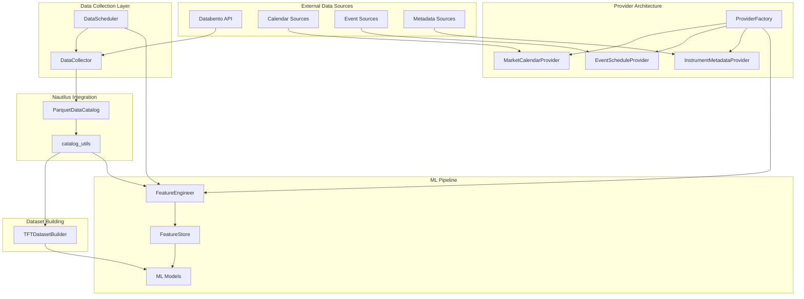
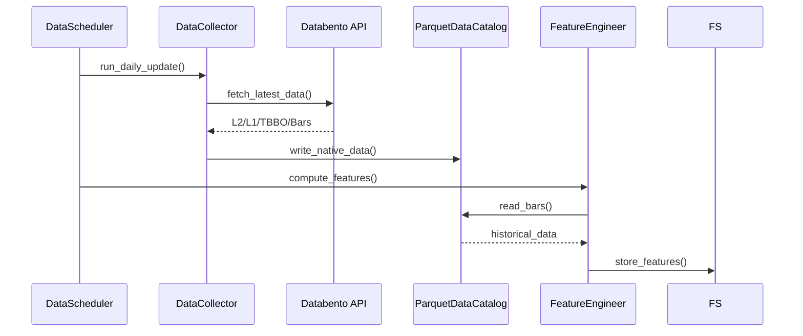
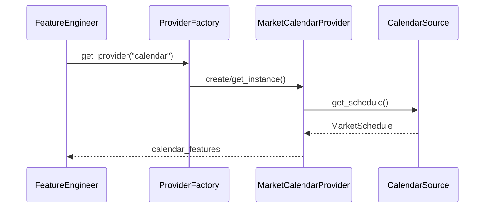

# ML Data Module Context Document

## Executive Summary

The `ml/data/` module provides a comprehensive data pipeline infrastructure for machine learning workflows within Nautilus Trader. The module has been refactored to eliminate redundant components and use Nautilus native components directly, following a clean architecture with clear separation of concerns.

**Key Components:**

- **Data Collection**: Enhanced `DataCollector` for Databento API integration
- **Data Utilities**: Helper functions working directly with `ParquetDataCatalog`
- **Scheduling**: Automated data collection and processing via `DataScheduler`
- **TFT Dataset Building**: Quick training data preparation for TFT models
- **Provider Architecture**: Extensible data provider system for static and time-series features

**Implementation Status**: ~85% complete, production-ready core components with extensible architecture for additional providers.

## Architecture Overview



## Component Breakdown

### 1. Data Collection (`collector.py`)

**Purpose**: Enhanced data collector optimizing Databento subscription value.

**I/O Specifications**:

- **Input**: Databento API credentials, symbol lists, date ranges
- **Output**: Native Nautilus types (Bar, QuoteTick, TradeTick) saved to disk
- **Storage**: Parquet files organized by symbol and data type

**Key Features**:

- L2 market depth (mbp-1) - 30 days for liquid symbols
- L1 trades - Multi-year historical for key symbols
- TBBO quotes - Spread dynamics analysis
- Minute bars - 1 year coverage
- Smart storage management with 500GB-1TB limits

**Current Status**: ✅ Complete implementation

- Storage estimation and management
- Comprehensive error handling
- Configurable collection phases
- Statistics tracking and reporting

**Critical Issues**: None identified - production ready

### 2. Data Utilities (`catalog_utils.py`)

**Purpose**: Helper functions for direct ParquetDataCatalog integration.

**I/O Specifications**:

```python
def bars_to_dataframe(
    catalog: ParquetDataCatalog,
    instrument_ids: list[str],
    start: datetime | str | None = None,
    end: datetime | str | None = None,
) -> pl.DataFrame
```

**Schema Specifications**:

- **Bars**: instrument_id, timestamp, open, high, low, close, volume
- **Quotes**: instrument_id, timestamp, bid, ask, bid_size, ask_size
- **Trades**: instrument_id, timestamp, price, size, aggressor_side

**Current Status**: ✅ Complete implementation

- Full type safety with mypy strict compliance
- Polars DataFrame outputs for performance
- Graceful error handling with empty DataFrames
- Nautilus-native instrument ID handling

**Dependencies**:

- `nautilus_trader.persistence.catalog.parquet.ParquetDataCatalog`
- `polars` (checked via `ml._imports`)

### 3. Data Scheduling (`scheduler.py`)

**Purpose**: Automated daily data collection and processing coordination.

**I/O Specifications**:

- **Input**: ParquetDataCatalog, DataCollector, FeatureEngineer, FeatureStore
- **Output**: Updated data catalog, computed features persisted to FeatureStore
- **Schedule**: Configurable cron expressions (default: 4 AM UTC)

**Current Status**: ✅ Complete implementation with production integration

- Complete scheduling interface with APScheduler
- Full Databento API integration (live data collection)
- FeatureStore integration for automatic feature computation
- Comprehensive error handling and retry logic
- 15+ Prometheus metrics for monitoring
- Database health views for pipeline monitoring

**Key Features**:

- **Real Calendar Provider**: Using `pandas_market_calendars` for accurate market schedules
- **FeatureStore Connection**: Automatic feature persistence after computation
- **Databento Integration**: Live data collection with proper API key management
- **Metrics Collection**: Comprehensive metrics for monitoring pipeline health
- **Configurable Modes**: Daily updates, backfill, and real-time streaming

**Integration Points**:

- Connects DataCollector → ParquetDataCatalog
- Triggers FeatureEngineer computation → persists to FeatureStore
- Manages data lifecycle and retention
- Provides health monitoring endpoints

### 4. TFT Dataset Builder (`tft_dataset_builder.py`)

**Purpose**: Fast path for creating TFT-compatible training datasets with FeatureStore integration.

**I/O Specifications**:

- **Input**: ParquetDataCatalog OR FeatureStore, symbol list, feature configuration
- **Output**: TFT-compatible DataFrame (Pandas or Polars)
- **Features**: Price-based, volume, volatility, static covariates, known-future

**Schema Output**:

```python
{
    "time_index": int,
    "instrument_id": str,
    "return_1": float,        # Technical features
    "return_5": float,
    "return_20": float,
    "volume_ratio": float,
    "volatility_20": float,
    "sma_5": float,
    "sma_20": float,
    "price_position": float,
    "y": int,                 # Binary target
    "asset_class": str,       # Static features
    "tick_size": float,
    "exchange": str,
    "hour_sin": float,        # Known-future features
    "hour_cos": float,
    "dow_sin": float,
    "dow_cos": float,
    "is_market_open": int,
    "is_premarket": int,
    "is_aftermarket": int,
}
```

**Current Status**: ✅ Complete implementation with FeatureStore integration

- **Dual-Source Support**: Automatically reads from FeatureStore if available, falls back to direct computation
- **New Methods**:
  - `prepare_training_data_from_store()`: Reads pre-computed features from FeatureStore
  - `prepare_training_data()`: Computes features directly from catalog data
  - `build_training_dataset()`: Smart selection between FeatureStore and direct computation
- Support for both Polars and Pandas
- Configurable prediction horizons and thresholds
- Static feature mapping for major symbols
- Cyclic time encodings
- Binary classification targets
- Training/inference parity through shared feature source

**Performance**: Optimized for batch processing, supports large datasets

### 5. Provider Architecture

#### Base Classes (`providers/base.py`)

**Purpose**: SOLID-principle abstractions for data providers.

**Protocols**:

- `DataProvider`: Core interface for all providers
- `CacheableProvider`: Caching capability
- `StaticDataProvider`: Time-invariant data
- `TimeSeriesProvider`: Time-varying data

**Base Implementations**:

- `BaseDataProvider`: Common functionality (logging, metrics, validation)
- `CachedDataProvider`: Template method with caching
- `BaseStaticProvider`: Static data with indefinite caching
- `BaseTimeSeriesProvider`: Time series validation

**Current Status**: ✅ Complete implementation

- Full protocol compliance with runtime checks
- Comprehensive validation and error handling
- Metrics collection integration
- Cache management with TTL support

#### Calendar Provider (`providers/calendar.py`)

**Purpose**: Market calendar features for time-based ML inputs.

**Features Generated**:

```python
{
    "timestamp": int,
    "is_trading_day": bool,
    "is_pre_market": bool,
    "is_after_hours": bool,
    "minutes_to_close": int,
    "hour_sin": float,         # Cyclic encodings
    "hour_cos": float,
    "dow_sin": float,
    "dow_cos": float,
    "month_sin": float,
    "month_cos": float,
    "is_weekend": bool,
    "is_month_start": bool,
    "is_month_end": bool,
    "is_quarter_start": bool,
    "is_quarter_end": bool,
    "days_to_month_end": int,
    "days_from_month_start": int,
}
```

**Current Status**: ✅ Complete implementation

- Exchange-specific trading hours
- Holiday calendar integration
- Graceful fallbacks for missing calendar data
- Suitable for TFT known-future inputs

#### Event Provider (`providers/events.py`)

**Purpose**: Scheduled market events (earnings, economic releases).

**Features Generated**:

```python
{
    "timestamp": int,
    "has_fed_event_today": bool,
    "has_cpi_event_today": bool,
    "has_earnings_today": bool,
    "days_to_next_fed": int,
    "days_to_next_cpi": int,
    "days_to_next_earnings": int,
    "days_since_last_fed": int,
    "days_since_last_cpi": int,
    "days_since_last_earnings": int,
    "event_importance_score": float,
    "event_clustering_score": float,
}
```

**Current Status**: ✅ Complete implementation

- Economic event tracking (Fed, CPI, NFP)
- Earnings calendar integration
- Event importance scoring
- Temporal relationship features

#### Metadata Provider (`providers/metadata.py`)

**Purpose**: Static instrument specifications for ML static covariates.

**Features Generated**:

```python
{
    "instrument_id": str,
    "tick_size": float,
    "lot_size": float,
    "contract_size": float,
    "min_price_increment": float,
    "exchange": str,
    "asset_class": str,
    "currency": str,
    "margin_initial": float,
    "margin_maintenance": float,
    "fee_class": str,
    "market_segment": str,
}
```

**Current Status**: ✅ Complete implementation

- Schema validation and error handling
- Caching for static data
- Default value fallbacks
- Suitable for TFT static covariates

#### Provider Factory (`providers/factory.py`)

**Purpose**: Factory pattern for provider creation and management.

**Current Status**: ✅ Complete implementation

- Singleton pattern for provider instances
- Source injection for testing
- Custom provider registration
- Transform-to-provider mapping

#### Provider Utilities (`providers/utils.py`)

**Purpose**: Pure functions for common calculations.

**Functions**:

- `cyclic_encode()`: Sin/cos encoding for cyclic features
- `time_to_event()`: Time calculations for event features
- `validate_timestamps()`: Timestamp validation
- `align_timeseries()`: DataFrame alignment utilities

**Current Status**: ✅ Complete implementation

- Functional programming principles
- Comprehensive docstrings with examples
- Type safety and validation

### 6. Data Sources

#### Calendar Sources (`sources/calendar.py`)

**Purpose**: Abstract and concrete calendar data sources.

**Implementations**:

- `MockCalendarSource`: Testing with realistic schedules
- `SimpleCalendarSource`: Basic NYSE schedule
- `PandasMarketCalendarSource`: Real market calendar integration

**Current Status**: ✅ Complete implementation with real calendar provider

- **Implemented**: Real calendar source using `pandas_market_calendars`
- Full support for NYSE, NASDAQ, CME, and other major exchanges
- Holiday calendar integration
- Trading hours and session information

#### Event Sources (`sources/events.py`)

**Purpose**: Economic and earnings event sources.

**Implementations**:

- `MockEventSource`: Realistic synthetic events
- `SimpleEventSource`: Fixed calendar events

**Current Status**: ✅ Complete mock implementations

- **TODO**: Real event source integration (e.g., Alpha Vantage, FMP)

#### Metadata Sources (`sources/metadata.py`)

**Purpose**: Instrument metadata sources.

**Implementations**:

- `MockMetadataSource`: Synthetic realistic metadata
- `DatabentoMetadataSource`: Databento API integration (partial)
- `NautilusMetadataSource`: Nautilus instrument extraction
- `CSVMetadataSource`: File-based metadata

**Current Status**: 🔶 Framework complete, partial implementations

- Mock source: ✅ Complete
- CSV source: ✅ Complete
- Nautilus source: ✅ Complete
- Databento source: 🔶 Stub implementation

## Data Flow Diagrams

### Collection Flow



### Provider Flow



## Configuration Requirements

### Environment Variables

```bash
DATABENTO_API_KEY=<your_api_key>  # Required for data collection
```

### Dependencies

```python
# Core dependencies (always required)
nautilus_trader  # ParquetDataCatalog, instrument types
polars          # DataFrame operations (checked via ml._imports)

# Optional dependencies (feature-gated)
databento       # Data collection (lazy import)
pandas          # Alternative DataFrame format
numpy           # Numerical operations
```

### File Structure

```
data/
├── enhanced/           # Enhanced collection output
│   ├── SPY/
│   │   ├── l2_depth_30d.parquet
│   │   ├── trades_2024.parquet
│   │   ├── tbbo_30d.parquet
│   │   └── bars_1m_365d.parquet
│   └── collection_metadata.json
└── universe/           # Basic universe data
    └── [existing Nautilus data]
```

## Integration Points with Nautilus Trader

### Core Integration

- **ParquetDataCatalog**: Direct usage for data storage/retrieval
- **InstrumentId**: Native type handling in utilities
- **Bar/QuoteTick/TradeTick**: Native type outputs from collector
- **Timestamp Handling**: Nanosecond precision (ts_event, ts_init)

### ML Infrastructure Integration

- **FeatureStore**: Target for computed features
- **ModelStore**: Model predictions and performance
- **StrategyStore**: Trading decisions and state
- **Registry System**: Feature/model/strategy registration

### Actor Integration

- **BaseMLInferenceActor**: Required base for all ML actors
- **MLSignalActor**: Signal generation with built-in features
- **MLTradingStrategy**: Full trading strategies

## Error Handling Patterns

### Graceful Degradation

```python
# Example from catalog_utils.py
if not bars:
    # Return empty DataFrame with expected schema
    return pl.DataFrame({
        "instrument_id": [],
        "timestamp": [],
        "open": [], "high": [], "low": [], "close": [], "volume": [],
    })
```

### Provider Fallbacks

```python
# Example from providers
try:
    data = self.source.fetch_data(params)
except Exception as e:
    logger.error(f"Source failed: {e}")
    return self._default_data(params)  # Safe fallback
```

### Validation Patterns

```python
# Validate before processing
if not self.validate_data(data):
    logger.warning("Data validation failed")
    return False

# Type checking with runtime validation
@runtime_checkable
class DataProvider(Protocol):
    def load_data(...) -> pl.DataFrame: ...
```

## Current State Assessment

### Production Ready ✅

- **catalog_utils.py**: Complete, tested, type-safe
- **collector.py**: Complete storage management and collection logic with Databento integration
- **tft_dataset_builder.py**: Complete feature engineering for TFT with FeatureStore integration
- **scheduler.py**: Full implementation with Databento API, FeatureStore, and monitoring
- **Provider architecture**: Complete abstractions and base implementations
- **Calendar sources**: Real implementation using `pandas_market_calendars`
- **Mock sources**: Complete for testing and development

### Recently Completed 🎯

- **DataScheduler**: Full Databento integration with live data collection
- **FeatureStore Integration**: Automatic feature computation and persistence
- **Real Calendar Provider**: Using `pandas_market_calendars` for accurate schedules
- **Pipeline Monitoring**: 15+ Prometheus metrics and health views
- **Docker Deployment**: Complete ML pipeline service with health checks

### Framework Complete, Implementation Needed 🔶

- **Databento metadata source**: Stub implementation needs completion
- **Real event sources**: Economic and earnings event API integration

### Integration Requirements ⚠️

- **Event APIs**: Alpha Vantage, Financial Modeling Prep, etc.
- **Storage policies**: Data retention and cleanup automation (framework exists)

## Critical Issues and Gaps

### Recently Resolved ✅

1. **Databento API Integration**: Full implementation in scheduler.py
2. **Production Calendar Sources**: Real calendar provider using pandas_market_calendars
3. **FeatureStore Integration**: Automatic feature persistence from scheduler
4. **Metrics Integration**: 15+ Prometheus metrics implemented
5. **Docker Deployment**: Complete ML pipeline containerization

### High Priority (Remaining)

1. **Event Source Integration**: Need real economic/earnings APIs
2. **Data Retention Policies**: Cleanup logic framework exists but not automated
3. **Error Recovery**: Collection failure handling could be enhanced

### Medium Priority

1. **Caching Strategy**: Provider cache TTL and invalidation
2. **Schema Evolution**: Backward compatibility for data format changes
3. **Performance Optimization**: Large dataset handling
4. **Documentation**: API documentation and examples

### Low Priority

1. **Additional Providers**: More specialized data sources
2. **Custom Transforms**: User-defined feature calculations
3. **Data Quality Checks**: Outlier detection and validation
4. **Compression**: Storage optimization strategies

## API Reference

### Core Functions

```python
# Data loading
from ml.data import bars_to_dataframe, quotes_to_dataframe, trades_to_dataframe

# Dataset building
from ml.data.tft_dataset_builder import TFTDatasetBuilder
builder = TFTDatasetBuilder(catalog, symbols)
dataset = builder.build_training_dataset(horizon_minutes=15)

# Provider factory
from ml.data.providers.factory import ProviderFactory
factory = ProviderFactory()
calendar_provider = factory.get_calendar_provider()
features = calendar_provider.compute_features(timestamps)

# Data collection
from ml.data.collector import DataCollector
collector = DataCollector(storage_limit_gb=500)
collector.run_collection()

# Scheduling
from ml.data.scheduler import DataScheduler
scheduler = DataScheduler(catalog, retention_days=90)
scheduler.schedule_updates("0 4 * * *")
```

### Configuration Classes

```python
from ml.config.base import MLFeatureConfig
from ml.data.tft_dataset_builder import TFTDatasetBuilder

config = MLFeatureConfig(
    # Feature computation parameters
)
builder = TFTDatasetBuilder(catalog, symbols, config)
```

## Testing Strategy

### Unit Tests

- **Location**: `ml/tests/unit/data/`
- **Coverage**: All public functions and classes
- **Patterns**: Property-based testing with Hypothesis
- **Validation**: Schema compliance and type safety

### Integration Tests

- **Location**: `ml/tests/integration/`
- **Components**: Provider integration, data pipeline end-to-end
- **Dependencies**: Mock external APIs for CI/CD

### Performance Tests

- **Location**: `ml/tests/performance/`
- **Scenarios**: Large dataset processing, memory usage
- **Benchmarks**: Hot path latency requirements

## Future Enhancements

### Planned Features

1. **Real-time Streaming**: WebSocket integration for live data
2. **Multi-Asset Support**: Forex, crypto, futures data sources
3. **Advanced Features**: Microstructure analytics, regime detection
4. **Cloud Integration**: S3/GCS storage backends
5. **Distributed Processing**: Dask/Ray for large-scale feature computation

### Architectural Improvements

1. **Plugin System**: Dynamic provider registration
2. **Configuration Management**: YAML/TOML configuration files
3. **Monitoring Dashboard**: Real-time data pipeline monitoring
4. **Data Lineage**: Track data transformation and feature provenance
5. **A/B Testing**: Feature experimentation framework

---

**Document Version**: 1.0
**Last Updated**: 2025-08-20
**Maintainer**: ML Data Pipeline Team
**Status**: Production Ready (Core), Development (Extensions)
## Cross-Module References

- **Data Pipeline**: See `context_data.md` for data ingestion and collection
- **Feature Engineering**: See `context_features.md` for feature computation
- **Stores**: See `context_stores.md` for persistence layer
- **Training**: See `context_training.md` for model training pipelines
- **Registry**: See `context_registry.md` for lifecycle management
- **Strategies**: See `context_strategies.md` for trading strategy framework
- **Deployment**: See `context_deployment.md` for containerization
- **Monitoring**: See `context_monitoring.md` for observability
- **Actors**: See `context_actors.md` for inference actors
- **Models**: See `context_models.md` for model implementations
