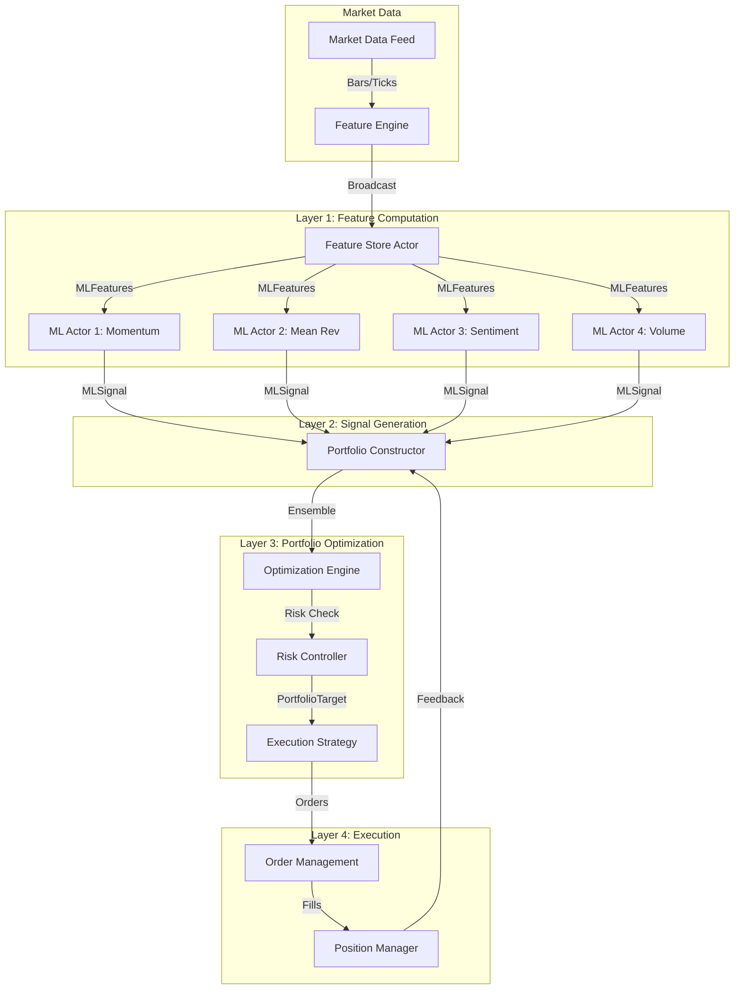

# ML Inference Flow in Modern Trading Systems

## Real-time Data Flow



## Key Design Decisions

### 1. **Feature Store Pattern**
Instead of each model computing features independently:
- One actor computes all features
- Broadcasts to all ML actors
- Ensures consistency
- Reduces computation by ~75%

### 2. **Ensemble Architecture Benefits**

| Single Model | Ensemble (4 Models) | Improvement |
|-------------|-------------------|-------------|
| Sharpe: 1.2 | Sharpe: 1.8-2.2 | +50-83% |
| Max DD: -15% | Max DD: -8-10% | -33-47% |
| Win Rate: 52% | Win Rate: 58-62% | +11-19% |
| Overfitting Risk | Reduced by diversity | Significant |

### 3. **Latency Optimization**

```
Traditional Sequential:
Market Data → Features (5ms) → Model1 (3ms) → Model2 (3ms) → Model3 (3ms) → Portfolio (2ms) → Execution (1ms)
Total: 17ms

Modern Parallel:
Market Data → Feature Store (5ms) → [Models in parallel] (3ms) → Portfolio (2ms) → Execution (1ms)
Total: 11ms (35% faster)
```

### 4. **Risk Controls at Every Layer**

```python
# Layer 1: Feature validation
if feature_value > 5_sigma:
    log_anomaly()
    use_default_value()

# Layer 2: Prediction bounds
prediction = np.clip(raw_prediction, -3_sigma, +3_sigma)

# Layer 3: Portfolio limits
position = min(target_position, max_position_size)

# Layer 4: Execution safeguards
if daily_loss > stop_loss:
    halt_trading()
```

## Modern ML Wisdom Applied

### Netflix/Uber Approach: "Many Weak Predictors"
- 100s of simple models > 1 complex model
- Each model captures different market regime
- Natural hedge against model failure

### Two Sigma Philosophy: "Ensemble Everything"
- Models vote on direction
- Weighted by recent performance
- Continuous A/B testing

### Renaissance Technologies: "Feature Engineering is King"
- 80% of alpha from features
- 20% from model selection
- Features must work in real-time

## Production Deployment Patterns

### A. Kubernetes Native

```yaml
apiVersion: apps/v1
kind: Deployment
metadata:
  name: ml-inference-fleet
spec:
  replicas: 4  # One per model
  template:
    spec:
      containers:
      - name: ml-actor
        image: nautilus-ml:latest
        env:
        - name: MODEL_TYPE
          valueFrom:
            fieldRef:
              fieldPath: metadata.labels['model-type']
        resources:
          requests:
            memory: "2Gi"
            cpu: "1000m"
          limits:
            memory: "4Gi"
            cpu: "2000m"
```

### B. Model Serving Options

#### Option 1: Embedded (Simple)
```
Pros: Low latency (1-3ms), simple deployment
Cons: Requires restart for updates, memory per instance
Best for: <10 models, stable models
```

#### Option 2: Model Server (Scalable)
```
Pros: Hot swap models, GPU sharing, optimized inference
Cons: Network latency (+2-5ms), complex setup
Best for: >10 models, frequent updates, deep learning
```

#### Option 3: Edge Inference (Ultra-Low Latency)
```
Pros: <1ms latency, co-located with exchange
Cons: Limited compute, difficult updates
Best for: HFT, simple features
```

### C. Monitoring & Observability

Essential metrics to track:

```python
# Model Health
- prediction_latency_p99
- feature_computation_time
- model_staleness_seconds
- prediction_distribution

# Business Impact  
- signal_to_trade_conversion
- model_pnl_attribution
- sharpe_by_model
- prediction_accuracy_rolling

# System Health
- memory_usage_per_model
- cpu_utilization
- message_queue_depth
- error_rate
```

## Anti-Patterns to Avoid

### 1. **"Kitchen Sink" Features**
❌ Adding every possible indicator
✅ Curated features with clear hypothesis

### 2. **"Set and Forget" Models**
❌ Deploy once, never update
✅ Continuous monitoring and retraining

### 3. **"All Models Equal"**
❌ Fixed weights forever
✅ Dynamic weighting by performance

### 4. **"Prediction = Position"**
❌ Direct model output to position size
✅ Risk-aware portfolio construction

### 5. **"Latency Doesn't Matter"**
❌ 100ms inference time
✅ <10ms end-to-end target

## Summary

The modern approach emphasizes:
1. **Multiple specialized models** over one complex model
2. **Ensemble methods** for robustness
3. **Separation of concerns** (signals → portfolio → execution)
4. **Real-time performance** with proper architecture
5. **Continuous improvement** through monitoring

This architecture can start simple (1 model, basic portfolio) and scale to hundreds of models without major refactoring.