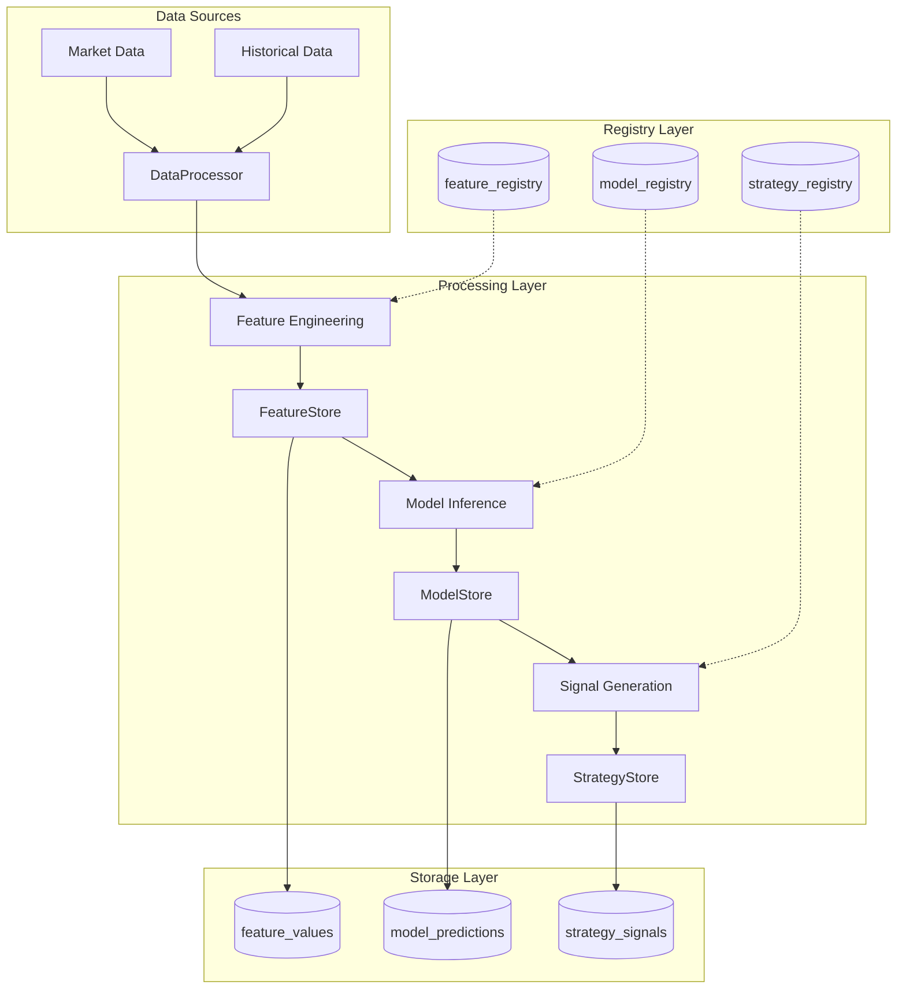

# ML Data Processing Architecture Analysis

## Current State Overview

### What We Have ✅

#### 1. **Registry Layer** (Metadata)
- `ml_registry.models` - Model metadata and versioning
- `ml_registry.features` - Feature set definitions
- `ml_registry.strategies` - Strategy configurations
- `ml_registry.registry_audit_log` - Change tracking

#### 2. **Store Layer** (Data Values)
- `ml_feature_values` - Computed feature values (partitioned)
- `ml_model_predictions` - Model prediction results (partitioned)
- `ml_strategy_signals` - Trading signals (partitioned)
- `ml_feature_computation_stats` - Performance metrics
- `ml_feature_lineage` - Feature transformation tracking
- `ml_strategy_performance` - Strategy performance metrics

#### 3. **Processing Components**
- `FeatureStore` - Manages feature computation and storage
- `ModelStore` - Handles model predictions with batching
- `StrategyStore` - Manages trading signals and risk metrics
- `DataProcessor` - Unified validation and enrichment pipeline
- `PartitionManager` - Automatic partition management

### What We're Missing ❌

#### 1. **Market Data Schema** 
The `DataProcessor` references these tables that don't exist:
```sql
-- MISSING: Market data tables
CREATE TABLE IF NOT EXISTS market_data (
    instrument_id VARCHAR(100) NOT NULL,
    ts_event BIGINT NOT NULL,
    bid DECIMAL(20,10),
    ask DECIMAL(20,10),
    bid_size DECIMAL(20,10),
    ask_size DECIMAL(20,10),
    volume DECIMAL(20,10),
    PRIMARY KEY (instrument_id, ts_event)
) PARTITION BY RANGE (ts_event);

CREATE TABLE IF NOT EXISTS market_data_metadata (
    instrument_id VARCHAR(100) PRIMARY KEY,
    symbol VARCHAR(50),
    exchange VARCHAR(50),
    asset_class VARCHAR(50),
    tick_size DECIMAL(10,8),
    lot_size DECIMAL(10,4),
    currency VARCHAR(10)
);
```

#### 2. **Position & Risk Tracking**
Referenced but not implemented:
- Current exposure tracking
- Position history
- Risk limits configuration

## Data Flow Architecture



## Safety & Correctness Analysis

### ✅ What's Correct

1. **Separation of Concerns**
   - Registry (metadata) vs Store (data) pattern properly implemented
   - Clear boundaries between processing stages

2. **Time-Based Partitioning**
   - All data tables use nanosecond timestamps (Nautilus convention)
   - Consistent partitioning strategy across stores
   - 36-month partition coverage (2024-2026)

3. **Data Quality**
   - Comprehensive validation pipeline with 8 quality flags
   - Outlier detection and handling
   - Feature drift monitoring
   - Calibration for predictions

4. **Performance Optimization**
   - Batch writing with auto-flushing
   - Connection pooling
   - BRIN indexes for time-series data
   - Caching for frequently accessed metadata

### ⚠️ Potential Issues

1. **Missing Market Data Source**
   - `DataProcessor` expects market data tables that don't exist
   - Need to either:
     - Create market data schema, OR
     - Integrate with Nautilus's existing data catalog

2. **Transaction Boundaries**
   - No explicit transaction management in batch operations
   - Risk of partial writes on failures

3. **Schema Evolution**
   - No migration versioning system
   - JSONB columns provide flexibility but lack schema validation

4. **Resource Management**
   - No circuit breaker implementation (mentioned in docs but not implemented)
   - Connection pool size not configurable

## Recommended Actions

### Immediate Fixes

1. **Create Missing Market Data Schema**
```sql
-- ml/stores/migrations/003_market_data.sql
CREATE TABLE IF NOT EXISTS market_data (
    instrument_id VARCHAR(100) NOT NULL,
    ts_event BIGINT NOT NULL,
    ts_init BIGINT NOT NULL,
    bid DECIMAL(20,10),
    ask DECIMAL(20,10),
    bid_size DECIMAL(20,10),
    ask_size DECIMAL(20,10),
    volume DECIMAL(20,10),
    open DECIMAL(20,10),
    high DECIMAL(20,10),
    low DECIMAL(20,10),
    close DECIMAL(20,10),
    PRIMARY KEY (instrument_id, ts_event)
) PARTITION BY RANGE (ts_event);

-- Create partitions
SELECT create_monthly_partitions('market_data', '2024-01-01'::DATE, 36);

-- Indexes
CREATE INDEX idx_market_data_lookup ON market_data USING BRIN (ts_event);
CREATE INDEX idx_market_data_instrument ON market_data (instrument_id, ts_event DESC);
```

2. **Add Transaction Management**
```python
# In stores/base.py
def write_batch_transactional(self, batch: list[Any]) -> int:
    """Write batch with transaction support."""
    with self.engine.begin() as conn:
        # All writes in transaction
        for item in batch:
            self._write_single(conn, item)
        return len(batch)
```

3. **Integration with Nautilus Data Catalog**
```python
# Alternative to market_data table: use existing Nautilus catalog
from nautilus_trader.persistence.catalog import ParquetDataCatalog

class DataProcessor:
    def __init__(self, catalog: ParquetDataCatalog = None):
        self.catalog = catalog  # Use Nautilus catalog instead of market_data table
```

### Architecture Recommendations

1. **Use Nautilus's Existing Infrastructure**
   - Leverage `ParquetDataCatalog` for market data instead of duplicating
   - Use `PersistenceManager` for all database operations
   - Integrate with Nautilus's event bus for real-time processing

2. **Add Missing Components**
   - Position tracking tables
   - Risk limits configuration
   - Circuit breaker implementation
   - Health check endpoints

3. **Improve Observability**
   - Add structured logging
   - Implement metrics collection (Prometheus)
   - Create monitoring dashboards

## Conclusion

The current implementation is **mostly correct and safe** with good architectural patterns:
- ✅ Proper separation of registry/store
- ✅ Consistent time-based partitioning
- ✅ Comprehensive data validation
- ✅ Performance optimizations

However, there are **gaps that need addressing**:
- ❌ Missing market data schema (or integration point)
- ❌ No transaction boundaries for batch operations
- ❌ Some referenced tables don't exist

**Recommendation**: The architecture is sound, but needs:
1. Market data integration (either new tables OR use Nautilus catalog)
2. Transaction management for data consistency
3. Complete the missing position/risk tracking components

The system is safe to use for development/testing but needs these gaps filled before production use.