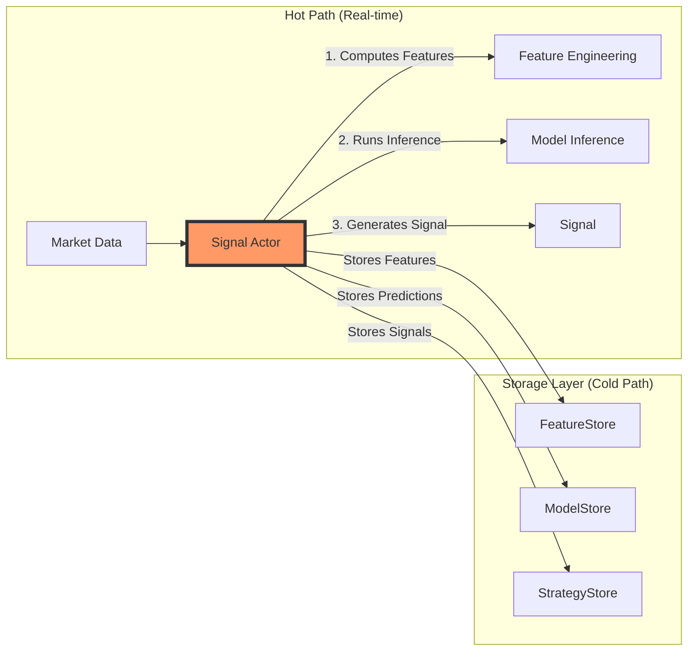

# ML Component Responsibilities - Corrected

## The Actual Data Flow



## What Each Component ACTUALLY Does

### 1. **Signal Actor** (ml/actors/signal.py)
**This is where inference happens!**

```python
class MLSignalActor(Actor):
    """Real-time ML inference actor"""
    
    def on_bar(self, bar):
        # 1. Compute features in real-time
        features = self._compute_features(bar)
        
        # 2. RUN MODEL INFERENCE HERE
        prediction = self.model.run(None, {
            'input': features.reshape(1, -1)
        })[0][0]
        
        # 3. Generate signal
        signal = MLSignal(
            instrument_id=bar.instrument_id,
            prediction=prediction,
            confidence=confidence,
            ts_event=bar.ts_event
        )
        
        # 4. Store everything (async/batch)
        self.feature_store.write_features(features)  # Store features
        self.model_store.write_prediction(prediction)  # Store prediction
        self.strategy_store.write_signal(signal)  # Store signal
```

### 2. **ModelStore** (ml/stores/model_store.py)
**This is a STORAGE component, NOT an inference component!**

```python
class ModelStore:
    """
    Stores model predictions AFTER they've been computed by actors.
    Does NOT run inference itself!
    """
    
    def write_prediction(self, 
                        model_id: str,
                        instrument_id: str, 
                        prediction: float,  # Already computed!
                        confidence: float,
                        features: dict[str, float],
                        inference_time_ms: float,
                        ts_event: int):
        """
        Store a prediction that was ALREADY COMPUTED by an actor.
        
        Purpose:
        - Historical record keeping
        - Performance analysis
        - Backtesting validation
        - Audit trail
        - Model performance monitoring
        """
        # Just stores the prediction, doesn't compute it
        self._batch_buffer.append({
            'model_id': model_id,
            'instrument_id': instrument_id,
            'prediction': prediction,  # Already computed elsewhere
            'confidence': confidence,
            'features_used': features,
            'inference_time_ms': inference_time_ms,
            'ts_event': ts_event,
        })
```

### 3. **FeatureStore** (ml/stores/feature_store.py)
**Stores computed features, doesn't compute them**

```python
class FeatureStore:
    """
    Stores feature values AFTER computation.
    Used for:
    - Training data collection
    - Feature drift monitoring
    - Backtesting validation
    - Debugging
    """
    
    def write_features(self, features: dict[str, float], ...):
        # Just storage, no computation
        pass
```

### 4. **StrategyStore** (ml/stores/strategy_store.py)
**Stores trading signals, doesn't generate them**

```python
class StrategyStore:
    """
    Stores signals AFTER they're generated.
    Used for:
    - Signal history
    - Performance analysis
    - Risk monitoring
    - Compliance/audit
    """
    
    def write_signal(self, signal: StrategySignal, ...):
        # Just storage, no signal generation
        pass
```

## The Correct Processing Flow

### Hot Path (Real-time Trading)
1. **Market Data** arrives
2. **Signal Actor** receives the data
3. **Signal Actor** computes features (using indicators)
4. **Signal Actor** runs model inference (ONNX/XGBoost/etc.)
5. **Signal Actor** generates trading signal
6. **Signal Actor** publishes signal to execution engine
7. **Signal Actor** (optionally) stores data to stores for history

### Cold Path (Training/Analysis)
1. **Historical Data** loaded from stores
2. **Feature Engineering** done in batch
3. **Model Training** using stored features
4. **Backtesting** using stored predictions
5. **Performance Analysis** using stored signals

## Why This Architecture?

### Separation of Concerns
- **Actors**: HOT path - compute in real-time
- **Stores**: COLD path - persist for analysis

### Performance
- Actors do the work (compute-intensive)
- Stores just save results (I/O-intensive)
- Batching in stores doesn't affect trading latency

### Key Insight
The stores are like a **data warehouse** - they store what happened, but don't make it happen. The actors are the **execution engine** - they do the actual work.

## Common Misconception

❌ **WRONG**: "ModelStore runs inference"
✅ **RIGHT**: "ModelStore stores the results of inference that was run by actors"

The naming might be confusing:
- `ModelStore` doesn't store models - it stores model **predictions**
- `FeatureStore` doesn't compute features - it stores feature **values**
- `StrategyStore` doesn't execute strategies - it stores strategy **signals**

Think of them as:
- `ModelPredictionStore`
- `FeatureValueStore`
- `StrategySignalStore`

## Example: Complete Flow

```python
# 1. Actor computes everything in real-time
class MLSignalActor(Actor):
    def on_bar(self, bar):
        # COMPUTE features
        sma = self.sma_indicator.value
        rsi = self.rsi_indicator.value
        features = {'sma': sma, 'rsi': rsi}
        
        # RUN inference
        prediction = self.onnx_model.run(features)
        
        # GENERATE signal
        if prediction > 0.7:
            signal = BuySignal(...)
        
        # EXECUTE trade
        self.submit_order(signal)
        
        # STORE for analysis (async, doesn't block)
        self.stores.save_all(features, prediction, signal)

# 2. Stores just persist the data
class Stores:
    def save_all(self, features, prediction, signal):
        # These just INSERT into database
        # No computation, just storage
        self.feature_store.write(features)     # INSERT INTO ml_feature_values
        self.model_store.write(prediction)     # INSERT INTO ml_model_predictions  
        self.strategy_store.write(signal)      # INSERT INTO ml_strategy_signals
```

## Summary

- **Actors** = Computation (features, inference, signals)
- **Stores** = Storage (save results for analysis)
- **ModelStore** stores predictions, doesn't make them
- **Inference happens in actors**, not in stores

The stores are for the "cold path" - analysis, backtesting, monitoring. The "hot path" (real trading) happens entirely in the actors.